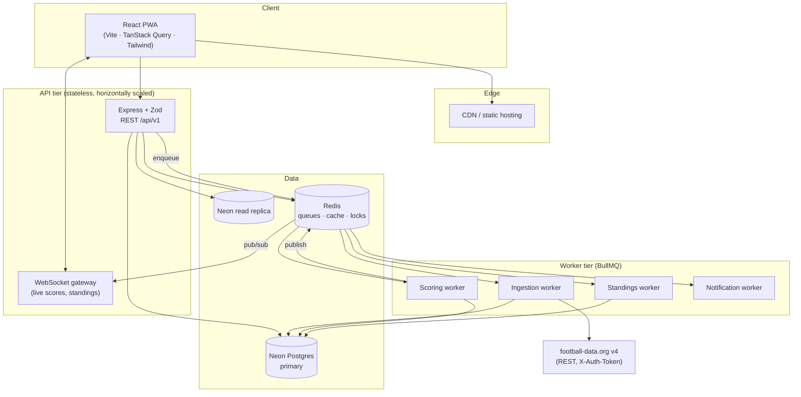
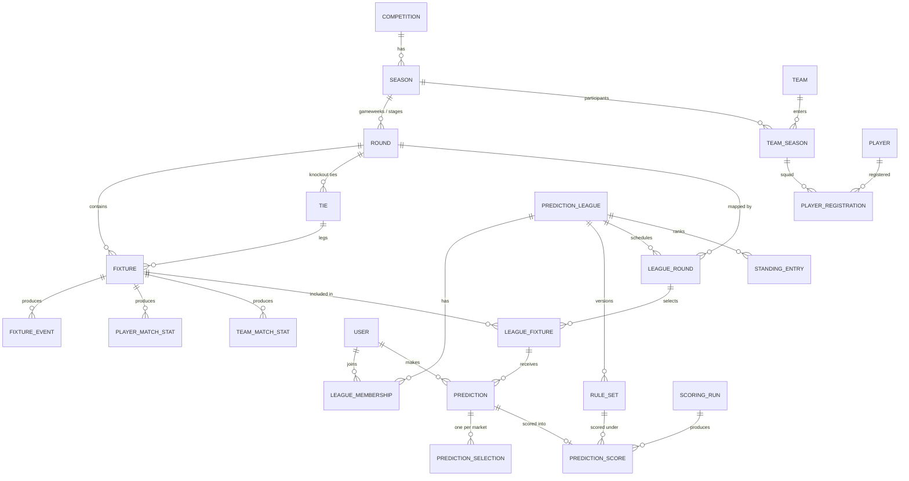
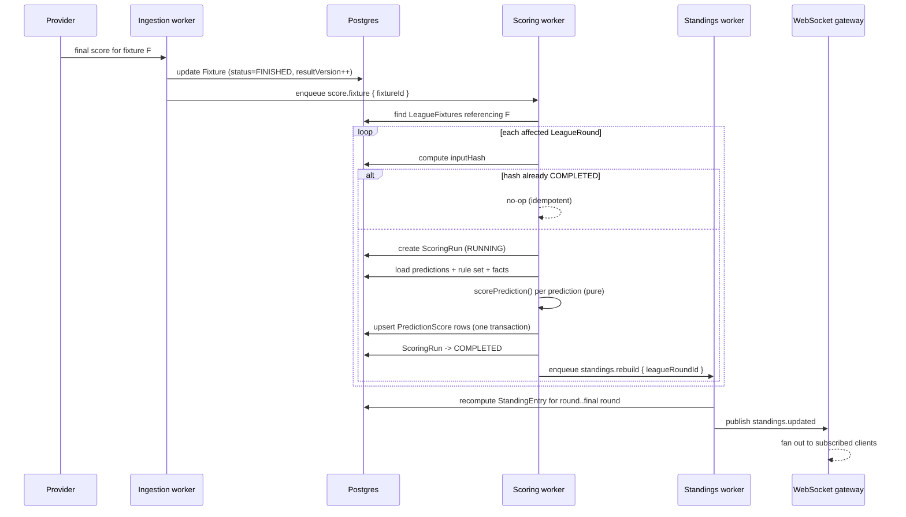

# WherePreds — System Architecture

**A football prediction platform where every user can build their own league, with their own rules.**

| | |
|---|---|
| **Status** | Draft v1.0 — design baseline, pre-implementation |
| **Stack** | PERN (PostgreSQL · Express · React · Node) + Prisma + Neon |
| **Football data** | football-data.org v4 — *Free + Deep Data* (€29/mo), no Statistic add-on (§11.5) |
| **Scope** | Top 5 European leagues (EPL, La Liga, Serie A, Bundesliga, Ligue 1) + UEFA Champions League |
| **Last updated** | 2026-08-18 |

---

## Table of contents

1. [Product goals and constraints](#1-product-goals-and-constraints)
2. [System overview](#2-system-overview)
3. [Technology choices](#3-technology-choices)
4. [Repository layout](#4-repository-layout)
5. [Domain model](#5-domain-model)
6. [Full database schema (Prisma)](#6-full-database-schema-prisma)
7. [Indexing, performance and Postgres specifics](#7-indexing-performance-and-postgres-specifics)
8. [The custom rules engine](#8-the-custom-rules-engine)
9. [Scoring pipeline](#9-scoring-pipeline)
10. [Deadlines and prediction locking](#10-deadlines-and-prediction-locking)
11. [Football data ingestion](#11-football-data-ingestion)
12. [API design](#12-api-design)
13. [Frontend architecture](#13-frontend-architecture)
14. [Design system — mobile-first, low-clutter](#14-design-system--mobile-first-low-clutter)
15. [Authentication and authorization](#15-authentication-and-authorization)
16. [Background jobs and real-time](#16-background-jobs-and-real-time)
17. [Observability, testing, and correctness guarantees](#17-observability-testing-and-correctness-guarantees)
18. [Deployment and environments](#18-deployment-and-environments)
19. [Delivery roadmap](#19-delivery-roadmap)
20. [Open decisions](#20-open-decisions)

---

## 1. Product goals and constraints

### 1.1 What the product does

1. **Maintains a canonical football dataset** for the top 5 domestic leagues **and the UEFA Champions League** — competitions, seasons, clubs, squads, players, fixtures, live results, match events, and aggregated player / club / league statistics. The UCL is not a sixth league: it is a structurally different competition (a 36-team league phase followed by two-legged knockout ties), and §5.2 covers what that costs the model.
2. **Lets any user create a prediction league** ("mini-league") over any competition + season, and invite friends.
3. **Lets the league creator define the rules**, not just pick a preset: which markets are predictable, how many points each is worth, what bonuses stack, what multipliers apply, when predictions lock, what boosters exist, and how ties are broken.
4. **Scores predictions deterministically and transparently** — every point a user earns is traceable to a named rule.
5. **Works excellently on a phone.** Most predictions get entered on a phone, minutes before kickoff, on poor connectivity.

### 1.2 Design constraints that shape everything below

| Constraint | Consequence |
|---|---|
| Rules are user-authored and unbounded in variety | Rules are **data**, not code. A declarative DSL, validated and interpreted — never user-supplied JavaScript. |
| Historical scores must never silently change | Rule sets are **immutable and versioned**. Editing rules creates version N+1; already-scored rounds keep pointing at version N. |
| Match results get corrected after the fact (VAR, disputed goals, abandonments) | Results carry a `resultVersion`. Scoring is **idempotent and re-runnable**; a corrected result triggers a rescore of exactly the affected rounds. |
| A user must never be able to predict a match they already know the result of | Locking is **server-authoritative** and enforced at write time; the client clock is never trusted. |
| Football data comes from a third-party provider that may change | All external identifiers live in a single mapping table (`ExternalRef`). No provider ID is ever a primary key. |
| The provider supplies **no per-player match statistics and no xG**, and we are not buying the match-statistics add-on for v1 | Everything we show is derived from scores, lineups and match events: goals, assists, cards, minutes, form, tables. Shots, possession and corners stay null. This is a prediction app before it is a stats app (§11.5). |
| The provider's rate limit is measured in **calls per minute**, not calls per month | Ingestion batches aggressively — one call fetches every live match across all six competitions. A naive per-fixture poll exhausts the budget on a Saturday afternoon. |
| The UCL has a league phase, two-legged knockout ties, and fixtures that do not exist until a draw is made | `Round` carries a structural `type`; `Fixture` optionally belongs to a `Tie`; a `LeagueRound` can exist with a provisional deadline before its fixtures are known. |
| Knockout matches can go to extra time and penalties | Rule sets declare a `knockoutScoreBasis`, so "the score" is defined by the league rather than assumed by us. Getting this wrong silently is the fastest way to an argument. |
| **Points settle at full time only** | Live match state is displayed but never scored (§9.4). The scoring engine is only ever fed terminal results, which keeps it simple and keeps leaderboards from flickering. |
| Mobile-first, poor connectivity | Round-scoped payloads, optimistic UI, offline-tolerant draft predictions, aggressive caching of static football data. |
| Neon is serverless Postgres | Connection pooling is mandatory; long-lived transactions are avoided; the API is stateless and horizontally scalable. |

### 1.3 Explicitly out of scope for v1

Real-money wagering, odds compilation, fantasy-football squad selection (this is *prediction*, not fantasy), **live in-play scoring** (§9.4), **match statistics — corners, shots, possession — and the corners market that depends on them** (§11.5), **xG and advanced per-player statistics** (the provider supplies neither), women's competitions, the Europa/Conference Leagues and domestic cups, and native mobile apps (the web app is a PWA instead).

---

## 2. System overview



### 2.1 The three bounded contexts

The system is deliberately split into three contexts that share a database but not a mental model. Keeping them separate is what stops the codebase collapsing into a tangle.

| Context | Owns | Written by | Read by |
|---|---|---|---|
| **Football** | Competitions, seasons, teams, players, fixtures, events, stats, standings | Ingestion worker only | Everyone |
| **Prediction** | Users' leagues, memberships, rule sets, rounds, predictions, boosters | API (user actions) | Everyone |
| **Scoring** | Scoring runs, prediction scores, league standings | Scoring worker only | Everyone |

**Rule:** the Football context never reads the Prediction context. The Prediction context never writes football data. The Scoring context is a pure function of the other two, and is the only writer of points. This one-directional flow is what makes rescoring safe.

---

## 3. Technology choices

| Layer | Choice | Why |
|---|---|---|
| Football data | **football-data.org v4** — *Free + Deep Data* plan (€29/mo) | Its 12-competition tier covers our exact scope (top 5 + UCL) at a fraction of what a 50-competition plan costs. Deep Data unlocks live scores, goalscorers, cards, substitutions and squads — everything a predictor needs. Match-statistics (corners, shots, possession) are a €15 add-on we are **not** buying for v1; see §11.5 for what that costs us and how to turn it on later. |
| Database | **Neon Postgres** | Serverless scale-to-zero, branch-per-PR for testing, generous relational modelling. Football data is deeply relational — a document store would be the wrong shape. |
| ORM | **Prisma** | Typed client shared end-to-end, migration history, good ergonomics for the ~35 models here. Raw SQL is used deliberately for standings and leaderboard aggregation. |
| API | **Express 5** + **Zod** | Requested stack. Zod schemas are shared with the frontend via `packages/shared`, so request/response types are validated once and inferred everywhere. |
| Frontend | **React 19 + Vite + TypeScript** | Requested stack. |
| Routing | **React Router v7** (framework mode off) | Simple nested routes; no need for a full metaframework since the API is separate. |
| Server state | **TanStack Query v5** | Caching, background refetch, optimistic mutations — exactly the primitives a prediction UI needs. |
| Styling | **Tailwind CSS v4** + a small token layer | Utility-first keeps the CSS surface tiny; tokens (§14) keep it consistent. |
| Components | **Radix Primitives** + local wrappers | Accessible behaviour without inheriting someone else's visual language. |
| Auth | **Lucia-style sessions** (opaque token, httpOnly cookie) + OAuth (Google, Apple) | Server-side sessions are revocable; JWTs are not. Prediction integrity depends on being able to kill a session instantly. |
| Queues | **BullMQ on Redis (Upstash)** | Retries, backoff, repeatable jobs, dead-letter — needed for provider flakiness. |
| Real-time | **WebSocket (`ws`) with Redis pub/sub fan-out** | Live scores and live standings during a match window. |
| Validation of rules | **Zod + custom interpreter** (`packages/scoring`) | The rule DSL must be validated before storage and evaluated deterministically. |
| Testing | **Vitest** (unit) · **Supertest** (API) · **Playwright** (E2E) · **Neon branches** (integration DB) | |

### 3.1 Why not a fantasy-style points table in the database?

A tempting shortcut is columns like `pointsForExactScore INT`. It dies the moment a user says *"double points in the final gameweek, and a 3× multiplier if you correctly predict an away win against a top-4 side."* The rule DSL (§8) exists to absorb that variety without a schema migration per feature request.

---

## 4. Repository layout

A pnpm monorepo. The scoring engine is a standalone package because it must be importable by both the API (for previews) and the worker (for real runs), and unit-testable with zero infrastructure.

```
wherepreds/
├── apps/
│   ├── web/                      # React PWA
│   │   ├── src/
│   │   │   ├── routes/           # route components, one folder per screen
│   │   │   ├── features/         # league/, predictions/, standings/, football/
│   │   │   ├── components/ui/    # design-system primitives
│   │   │   ├── lib/              # api client, query keys, formatters
│   │   │   └── styles/tokens.css
│   │   └── vite.config.ts
│   ├── api/                      # Express REST + WS gateway
│   │   └── src/
│   │       ├── routes/v1/
│   │       ├── middleware/       # auth, rate limit, error, request-id
│   │       ├── services/         # use-cases; the only place with business logic
│   │       └── ws/
│   └── worker/                   # BullMQ processors
│       └── src/jobs/             # ingest.*, score.*, standings.*, notify.*
├── packages/
│   ├── db/                       # Prisma schema, migrations, seed, typed client
│   │   ├── prisma/schema.prisma
│   │   ├── prisma/migrations/
│   │   └── src/index.ts
│   ├── scoring/                  # PURE. no db, no io.
│   │   ├── src/dsl.ts            # Zod schema for RuleSetConfig
│   │   ├── src/facts.ts          # builds the fact object from prediction+result
│   │   ├── src/evaluate.ts       # the interpreter
│   │   └── src/presets.ts        # Classic, Exact-Score-Heavy, Underdog, Survival
│   ├── shared/                   # Zod DTOs + inferred types shared web↔api
│   └── config/                   # eslint, tsconfig, tailwind preset
├── docs/
│   ├── architecture.md           # ← this file
│   └── architecture_instructions.md
└── pnpm-workspace.yaml
```

**Dependency rule (enforced by ESLint `import/no-restricted-paths`):**
`web → shared`, `api → shared, db, scoring`, `worker → shared, db, scoring`, `scoring → shared` only.
`scoring` must never import `db`. If it needs data, it is passed in.

---

## 5. Domain model



### 5.1 The five entities that carry the design

**`RuleSet`** — an immutable, versioned rule document per league. Contains a validated JSON `config` plus a handful of promoted columns for querying. Creating rules is cheap; changing them is a new version.

**`LeagueRound`** — the join between a real football gameweek (`Round`) and a prediction league. It holds the *league's own* deadline, its own status, and which rule-set version it was scored under. Two leagues on the same gameweek can have entirely different deadlines and rules.

**`LeagueFixture`** — lets a league play a subset of the gameweek (e.g. "only the 6 televised matches") and attach a per-fixture weight (e.g. "the derby is worth double"). Predictions attach here, not to `Fixture` directly.

**`PredictionSelection`** — one row per market predicted, so a single prediction on one match can simultaneously carry an exact score, a first goalscorer, and a BTTS call, with each scored independently.

**`PredictionScore`** — the result of scoring, storing not only `points` but a `breakdown` array naming every rule that fired. This is what powers the "why did I get 7 points?" panel, and it is what makes disputes resolvable.

### 5.2 What the Champions League costs the model

Adding the UCL is cheap in three places and genuinely awkward in four. Worth being explicit about which is which, because the awkward ones are where bugs will live.

**Free, because the model is already shaped for it:**

- **A club in two competitions at once.** `Season` is scoped to a competition, so Real Madrid's 2025/26 La Liga season and their 2025/26 UCL season are two separate `Season` rows and two separate `TeamSeason` rows. Their league goals and their European goals aggregate independently in `PlayerSeasonStat` without a single schema change — and combining them is a `SUM` over two rows, not a migration.
- **A single 36-team league-phase table.** `StandingRow` already models an ordered table keyed by season and round. The 2024/25+ league phase is just a table with 36 rows instead of 20.
- **Separate European squad registration.** UEFA's A-list is a genuinely different squad from the domestic one, and `PlayerRegistration` hangs off `TeamSeason` — so the two lists are naturally distinct rather than accidentally shared.

**Not free:**

1. **A competition without a country.** `Competition.countryId` becomes nullable, with a `confederation` field alongside it. Trivial, but it means every UI that renders a flag next to a competition needs a fallback.
2. **Rounds are no longer just matchdays.** `Round.type` distinguishes `LEAGUE_PHASE` from `ROUND_OF_16` from `FINAL`. Anything that assumed `Round.number` is a matchday index — sorting, "next gameweek", round labels — must read `type` too.
3. **Two-legged ties.** Two fixtures whose *combined* result decides who advances. Modelled as a first-class `Tie` with an aggregate and a winner, because "who goes through?" is the single most-predicted question in knockout football, and inferring it from two unrelated fixture rows at scoring time would be fragile.
4. **Fixtures that do not exist yet.** After the league phase, the R16 lineup is unknown until the draw. A `LeagueRound` must therefore be creatable with a *provisional* deadline and zero fixtures, then filled in when the draw lands. §10.5 covers the sequencing.

**`Tie`** — a knockout tie between two clubs, owning the aggregate score, the winner, and *how* it was decided (aggregate, extra time, or penalties). Its `resultVersion` feeds the same idempotency hash as its fixtures', so a corrected second leg rescores the tie-level `TO_QUALIFY` predictions too.

---

## 6. Full database schema (Prisma)

> File: `packages/db/prisma/schema.prisma`

```prisma
generator client {
  provider        = "prisma-client-js"
  previewFeatures = ["relationJoins", "nativeDistinct"]
}

datasource db {
  provider  = "postgresql"
  url       = env("DATABASE_URL")       // pooled (pgBouncer) connection
  directUrl = env("DIRECT_URL")         // direct connection, for migrations
}

// ═══════════════════════════════════════════════════════════════════
//  ENUMS
// ═══════════════════════════════════════════════════════════════════

enum CompetitionType {
  LEAGUE
  DOMESTIC_CUP
  LEAGUE_CUP
  SUPER_CUP
  CONTINENTAL          // UEFA Champions League
}

/// Structural stage a round belongs to. Domestic leagues only ever use
/// REGULAR_SEASON. Anything that sorts or labels rounds must read this —
/// Round.number is a matchday index in a league and a stage index in a cup.
/// Provider `stage` → RoundType mapping, verified live 2026-08-18 against the
/// 2024/25 UCL (189 matches). Unrecognised stage values MUST throw (§11.1).
enum RoundType {
  REGULAR_SEASON       // ← "REGULAR_SEASON"
  GROUP_STAGE          // ← "GROUP_STAGE"   pre-2024/25 UCL, historical seasons
  LEAGUE_PHASE         // ← "LEAGUE_STAGE"  144 matches; undocumented value
  KNOCKOUT_PLAYOFF     // ← "PLAYOFFS"       16 matches = 8 ties × 2 legs
  ROUND_OF_16          // ← "LAST_16"        16 matches = 8 ties × 2 legs
  QUARTER_FINAL        // ← "QUARTER_FINALS"  8 matches = 4 ties × 2 legs
  SEMI_FINAL           // ← "SEMI_FINALS"     4 matches = 2 ties × 2 legs
  FINAL                // ← "FINAL"           1 match, single leg
}

/// How a two-legged tie was ultimately settled.
enum TieDecider {
  AGGREGATE
  EXTRA_TIME
  PENALTIES
  AWARDED              // decided off the pitch
}

/// How a rule set interprets "the score" for a match that can run past 90'.
/// Declared per league because leagues genuinely disagree, and guessing on
/// their behalf produces the worst kind of dispute.
enum KnockoutScoreBasis {
  NINETY_MINUTES       // default: normal time only, matching most house rules
  AFTER_EXTRA_TIME
  INCLUDING_PENALTIES  // the shootout decides the outcome market
}

enum FixtureStatus {
  SCHEDULED
  DELAYED
  LIVE
  HALF_TIME
  SECOND_HALF
  EXTRA_TIME
  PENALTY_SHOOTOUT
  FINISHED
  POSTPONED
  ABANDONED
  CANCELLED
  AWARDED          // result decided off the pitch
}

enum PositionGroup {
  GOALKEEPER
  DEFENDER
  MIDFIELDER
  FORWARD
}

enum PreferredFoot {
  LEFT
  RIGHT
  BOTH
  UNKNOWN
}

enum MatchEventType {
  GOAL
  OWN_GOAL
  PENALTY_SCORED
  PENALTY_MISSED
  ASSIST
  YELLOW_CARD
  SECOND_YELLOW
  RED_CARD
  SUBSTITUTION
  VAR_DECISION
  PENALTY_SHOOTOUT_SCORED
  PENALTY_SHOOTOUT_MISSED
}

enum MatchOutcome {
  HOME
  DRAW
  AWAY
}

/// Markets a league may enable. Adding one requires: an enum value,
/// a fact-builder branch in packages/scoring/src/facts.ts, and a UI input.
///
/// Availability is provider-dependent (§11.5). Markets marked [DEEP] need the
/// Deep Data plan, which we have. [STAT] needs the Statistic add-on, which we
/// have NOT bought for v1 — those markets are defined here but gated off, and
/// /rules/validate rejects any league trying to enable one. Buying the add-on
/// flips a capability flag; it is not a schema or code change.
enum MarketType {
  EXACT_SCORE
  MATCH_OUTCOME            // 1X2
  DOUBLE_CHANCE
  BOTH_TEAMS_TO_SCORE
  TOTAL_GOALS_OVER_UNDER
  CORRECT_MARGIN
  HALF_TIME_OUTCOME          // score.halfTime, available on every plan
  FIRST_GOALSCORER           // [DEEP] needs the goals[] array
  ANYTIME_GOALSCORER         // [DEEP]
  CLEAN_SHEET
  RED_CARD_SHOWN             // [DEEP] needs the bookings[] array
  TOTAL_CORNERS_OVER_UNDER   // [STAT] NOT AVAILABLE in v1 — gated off
  /// Knockout only: which club advances. Asked on the deciding leg, scored
  /// against Tie.winnerTeamId rather than against a single fixture's score.
  TO_QUALIFY
}

enum LeagueVisibility {
  PUBLIC        // listed, anyone may join
  UNLISTED      // join by code/link only
  PRIVATE       // invite only
}

enum MemberRole {
  OWNER
  ADMIN
  MEMBER
}

enum MemberStatus {
  ACTIVE
  INVITED
  REQUESTED
  LEFT
  REMOVED
  BANNED
}

enum LeagueRoundStatus {
  UPCOMING      // deadline in the future, predictions open
  LOCKED        // deadline passed, matches in progress
  PROVISIONAL   // scored, but results may still be corrected
  FINAL         // scored and settled
  VOID          // round abandoned, no points awarded
}

enum PredictionStatus {
  DRAFT         // saved locally / autosaved, not counted
  SUBMITTED     // counted once the deadline passes
  LOCKED        // deadline passed, immutable
  SCORED
  VOID          // fixture cancelled under a rule set that voids
  MISSED        // no prediction made; may attract a default per rules
}

enum DeadlineStrategy {
  PER_FIXTURE_KICKOFF     // each match locks individually at kickoff - offset
  ROUND_FIRST_KICKOFF     // whole round locks at first kickoff - offset
  FIXED_DATETIME          // explicit datetime set by the league admin
  CUSTOM_PER_ROUND        // admin sets each round manually
}

enum BoosterType {
  DOUBLE_POINTS       // one fixture, ×2
  TRIPLE_POINTS       // one fixture, ×3
  BANKER              // nominate a fixture; multiplier from config
  INSURANCE           // floor a round's score at the user's average
  WILDCARD_ROUND      // whole round multiplied
  NO_NEGATIVES        // suppress negative points for a round
}

enum ScoringRunStatus {
  QUEUED
  RUNNING
  COMPLETED
  FAILED
  SUPERSEDED
}

enum IngestJobStatus {
  QUEUED
  RUNNING
  SUCCEEDED
  FAILED
  PARTIAL
}

enum ExternalEntity {
  COMPETITION
  SEASON
  TEAM
  PLAYER
  FIXTURE
  VENUE
  ROUND
  TIE
}

// ═══════════════════════════════════════════════════════════════════
//  CONTEXT 1 — FOOTBALL DATA  (written only by the ingestion worker)
// ═══════════════════════════════════════════════════════════════════

model Country {
  id           String        @id @default(cuid())
  name         String        @unique
  isoCode      String?       @unique @db.VarChar(3)
  flagUrl      String?

  competitions Competition[]
  teams        Team[]
  players      Player[]

  @@map("countries")
}

model Competition {
  id          String          @id @default(cuid())
  /// Stable internal slug, e.g. "premier-league". Safe to use in URLs.
  slug        String          @unique
  name        String
  shortName   String?
  type        CompetitionType @default(LEAGUE)
  /// 1 = top flight. Used for "top 5 leagues" filtering and rule context.
  tier        Int             @default(1)
  logoUrl     String?
  /// Null for continental competitions — the UCL belongs to no country.
  /// Every flag-rendering surface needs a fallback because of this.
  countryId   String?
  /// "UEFA" for the Champions League, null for domestic competitions.
  confederation String?
  isSupported Boolean         @default(true)
  createdAt   DateTime        @default(now())
  updatedAt   DateTime        @updatedAt

  country     Country?        @relation(fields: [countryId], references: [id])
  seasons     Season[]

  @@index([countryId])
  @@index([isSupported, tier])
  @@map("competitions")
}

model Season {
  id             String            @id @default(cuid())
  competitionId  String
  /// Display label, e.g. "2025/26"
  label          String
  /// Starting calendar year, e.g. 2025. Used for ordering.
  startYear      Int
  startDate      DateTime          @db.Date
  endDate        DateTime          @db.Date
  isCurrent      Boolean           @default(false)
  /// Number of matchdays; null for cups.
  totalRounds    Int?
  createdAt      DateTime          @default(now())
  updatedAt      DateTime          @updatedAt

  competition    Competition       @relation(fields: [competitionId], references: [id], onDelete: Cascade)
  rounds         Round[]
  teamSeasons    TeamSeason[]
  fixtures       Fixture[]
  ties           Tie[]
  standings      StandingRow[]
  playerSeasons  PlayerSeasonStat[]
  leagues        PredictionLeague[]

  @@unique([competitionId, startYear])
  @@index([isCurrent])
  @@map("seasons")
}

model Round {
  id          String        @id @default(cuid())
  seasonId    String
  /// Ordinal within the season. A matchday index in a league; a stage index
  /// in a cup. Never assume it means "matchday" without checking `type`.
  number      Int
  name        String        // "Matchday 12", "Round of 16"
  type        RoundType     @default(REGULAR_SEASON)
  /// Set only for the pre-2024/25 UCL group stage ("Group C").
  groupName   String?
  /// True for knockout rounds played over two legs (not the final).
  isTwoLegged Boolean       @default(false)
  startsAt    DateTime?
  endsAt      DateTime?
  isCurrent   Boolean       @default(false)

  /// When the draw for this round takes place. Until it happens the fixture
  /// list is empty and any LeagueRound built on it is provisional.
  drawAt      DateTime?
  /// False while fixtures are still unknown or subject to a draw.
  isScheduleFinal Boolean   @default(true)

  season      Season        @relation(fields: [seasonId], references: [id], onDelete: Cascade)
  fixtures    Fixture[]
  ties        Tie[]
  standings   StandingRow[]
  leagueRounds LeagueRound[]

  @@unique([seasonId, number])
  @@index([seasonId, startsAt])
  @@index([seasonId, type])
  @@map("rounds")
}

/// A knockout tie between two clubs, played over one leg (the final) or two.
/// First-class because "who goes through?" is the most-predicted question in
/// knockout football, and deriving it from two loose fixtures at scoring time
/// would be the fragile way to answer it.
model Tie {
  id            String      @id @default(cuid())
  seasonId      String
  roundId       String
  /// Team A is the side at home in the first leg.
  teamAId       String
  teamBId       String

  aggregateA    Int?
  aggregateB    Int?
  winnerTeamId  String?
  decidedBy     TieDecider?
  /// Set when the tie is settled; null while any leg is unplayed.
  settledAt     DateTime?
  /// Feeds the same scoring idempotency hash as its fixtures', so a corrected
  /// second leg also rescores the tie-level TO_QUALIFY predictions.
  resultVersion Int         @default(0)

  createdAt     DateTime    @default(now())
  updatedAt     DateTime    @updatedAt

  season        Season      @relation(fields: [seasonId], references: [id], onDelete: Cascade)
  round         Round       @relation(fields: [roundId], references: [id], onDelete: Cascade)
  teamA         Team        @relation("TieTeamA", fields: [teamAId], references: [id])
  teamB         Team        @relation("TieTeamB", fields: [teamBId], references: [id])
  winner        Team?       @relation("TieWinner", fields: [winnerTeamId], references: [id])
  fixtures      Fixture[]

  @@unique([roundId, teamAId, teamBId])
  @@index([seasonId])
  @@index([winnerTeamId])
  @@map("ties")
}

model Venue {
  id        String   @id @default(cuid())
  name      String
  city      String?
  capacity  Int?
  surface   String?
  imageUrl  String?

  teams     Team[]
  fixtures  Fixture[]

  @@index([name])
  @@map("venues")
}

model Team {
  id           String       @id @default(cuid())
  slug         String       @unique
  name         String
  shortName    String?
  /// 3-letter code used in compact mobile fixture rows: "MCI", "RMA".
  tla          String?      @db.VarChar(4)
  crestUrl     String?
  /// Primary brand colour, used for subtle accenting only (see §14.4).
  primaryColor String?      @db.VarChar(9)
  foundedYear  Int?
  countryId    String?
  venueId      String?
  createdAt    DateTime     @default(now())
  updatedAt    DateTime     @updatedAt

  country      Country?     @relation(fields: [countryId], references: [id])
  venue        Venue?       @relation(fields: [venueId], references: [id])
  teamSeasons  TeamSeason[]
  homeFixtures Fixture[]    @relation("HomeTeam")
  awayFixtures Fixture[]    @relation("AwayTeam")
  tiesAsA      Tie[]        @relation("TieTeamA")
  tiesAsB      Tie[]        @relation("TieTeamB")
  tiesWon      Tie[]        @relation("TieWinner")
  standings    StandingRow[]
  matchStats   TeamMatchStat[]
  events       FixtureEvent[]
  playerSeasons PlayerSeasonStat[]
  selections   PredictionSelection[]

  @@index([name])
  @@map("teams")
}

/// A club's participation in one season. The anchor for squads and club stats.
model TeamSeason {
  id            String                @id @default(cuid())
  teamId        String
  seasonId      String

  team          Team                  @relation(fields: [teamId], references: [id], onDelete: Cascade)
  season        Season                @relation(fields: [seasonId], references: [id], onDelete: Cascade)
  registrations PlayerRegistration[]
  stat          TeamSeasonStat?

  @@unique([teamId, seasonId])
  @@index([seasonId])
  @@map("team_seasons")
}

model Player {
  id            String                @id @default(cuid())
  slug          String                @unique
  firstName     String?
  lastName      String?
  /// Name as displayed on a shirt / in a lineup.
  displayName   String
  dateOfBirth   DateTime?             @db.Date
  nationalityId String?
  heightCm      Int?
  weightKg      Int?
  position      PositionGroup?
  /// Finer-grained role, e.g. "Left-Back", "Attacking Midfield".
  detailedRole  String?
  preferredFoot PreferredFoot         @default(UNKNOWN)
  photoUrl      String?
  createdAt     DateTime              @default(now())
  updatedAt     DateTime              @updatedAt

  nationality   Country?              @relation(fields: [nationalityId], references: [id])
  registrations PlayerRegistration[]
  matchStats    PlayerMatchStat[]
  seasonStats   PlayerSeasonStat[]
  events        FixtureEvent[]        @relation("EventPlayer")
  relatedEvents FixtureEvent[]        @relation("EventRelatedPlayer")
  selections    PredictionSelection[]

  @@index([displayName])
  @@index([position])
  @@map("players")
}

/// A player's spell at a club within a season (handles mid-season transfers
/// and loans without losing history).
model PlayerRegistration {
  id           String     @id @default(cuid())
  playerId     String
  teamSeasonId String
  shirtNumber  Int?
  onLoan       Boolean    @default(false)
  joinedAt     DateTime?  @db.Date
  leftAt       DateTime?  @db.Date

  player       Player     @relation(fields: [playerId], references: [id], onDelete: Cascade)
  teamSeason   TeamSeason @relation(fields: [teamSeasonId], references: [id], onDelete: Cascade)

  @@unique([playerId, teamSeasonId, joinedAt])
  @@index([teamSeasonId])
  @@index([playerId])
  @@map("player_registrations")
}

model Fixture {
  id               String          @id @default(cuid())
  seasonId         String
  roundId          String?
  /// Set for knockout legs; null for league matches.
  tieId            String?
  /// 1 or 2 within a two-legged tie; 1 for a one-off final.
  legNumber        Int?
  homeTeamId       String
  awayTeamId       String
  venueId          String?
  kickoffAt        DateTime
  status           FixtureStatus   @default(SCHEDULED)
  /// Minutes played, for live displays.
  minute           Int?

  /// ⚠️ From score.regularTime — NEVER score.fullTime, which on a knockout
  /// match is regularTime+extraTime+penalties summed into a scoreline that
  /// never happened (§11.1). This is the 90-minute score, always.
  homeGoals        Int?
  awayGoals        Int?
  homeGoalsHt      Int?          // score.halfTime
  awayGoalsHt      Int?
  /// score.extraTime — goals scored in ET only, not cumulative.
  homeGoalsEt      Int?
  awayGoalsEt      Int?
  /// score.penalties — shootout only (score.duration = PENALTY_SHOOTOUT).
  homePenalties    Int?
  awayPenalties    Int?
  /// From score.winner: HOME_TEAM | AWAY_TEAM | DRAW.
  outcome          MatchOutcome?

  /// Bumped on every correction to a finished result. The scoring engine keys
  /// idempotency on this, so a VAR reversal reliably triggers a rescore.
  resultVersion    Int             @default(0)
  /// Set when a final score first becomes official.
  resultConfirmedAt DateTime?

  createdAt        DateTime        @default(now())
  updatedAt        DateTime        @updatedAt

  season           Season          @relation(fields: [seasonId], references: [id], onDelete: Cascade)
  round            Round?          @relation(fields: [roundId], references: [id])
  tie              Tie?            @relation(fields: [tieId], references: [id])
  homeTeam         Team            @relation("HomeTeam", fields: [homeTeamId], references: [id])
  awayTeam         Team            @relation("AwayTeam", fields: [awayTeamId], references: [id])
  venue            Venue?          @relation(fields: [venueId], references: [id])

  events           FixtureEvent[]
  teamStats        TeamMatchStat[]
  playerStats      PlayerMatchStat[]
  leagueFixtures   LeagueFixture[]

  @@unique([tieId, legNumber])
  @@index([seasonId, kickoffAt])
  @@index([roundId])
  @@index([status, kickoffAt])
  @@index([homeTeamId])
  @@index([awayTeamId])
  @@map("fixtures")
}

model FixtureEvent {
  id               String         @id @default(cuid())
  fixtureId        String
  teamId           String?
  playerId         String?
  /// Assisting player, or the player coming on in a substitution.
  relatedPlayerId  String?
  type             MatchEventType
  minute           Int
  extraMinute      Int?
  detail           String?
  /// Sequence within the match, so "first goalscorer" is unambiguous.
  sequence         Int

  fixture          Fixture        @relation(fields: [fixtureId], references: [id], onDelete: Cascade)
  team             Team?          @relation(fields: [teamId], references: [id])
  player           Player?        @relation("EventPlayer", fields: [playerId], references: [id])
  relatedPlayer    Player?        @relation("EventRelatedPlayer", fields: [relatedPlayerId], references: [id])

  @@unique([fixtureId, sequence])
  @@index([fixtureId, type])
  @@index([playerId, type])
  @@map("fixture_events")
}

/// ⚠️ In v1 this table holds card counts only. Everything else comes from the
/// match object's `statistics` block, which needs the Statistic add-on we have
/// not bought (§11.5). The model and its ingest path are written and inert;
/// buying the add-on populates them without a migration.
/// Team-level *season* aggregates (record, form, goals, clean sheets) are
/// unaffected — TeamSeasonStat is computed from our own results, not from here.
model TeamMatchStat {
  id             String   @id @default(cuid())
  fixtureId      String
  teamId         String
  isHome         Boolean

  // ── Derived from bookings[]. Populated today. ──
  yellowCards    Int?
  redCards       Int?

  // ── Statistic add-on. Null in v1. ──
  possession     Decimal? @db.Decimal(5, 2)
  shots          Int?
  shotsOnTarget  Int?
  corners        Int?                          // would back the corners market
  fouls          Int?
  offsides       Int?

  // ── Not available from this provider at any price. ──
  expectedGoals  Decimal? @db.Decimal(5, 2)
  passes         Int?
  passAccuracy   Decimal? @db.Decimal(5, 2)
  saves          Int?

  fixture        Fixture  @relation(fields: [fixtureId], references: [id], onDelete: Cascade)
  team           Team     @relation(fields: [teamId], references: [id])

  @@unique([fixtureId, teamId])
  @@index([teamId])
  @@map("team_match_stats")
}

/// ⚠️ Provider reality (§11.5): football-data.org publishes no per-player match
/// statistics. Everything above the divider is DERIVED by us from the match's
/// lineup, bench, goals[], bookings[] and substitutions[] arrays. Everything
/// below stays null on this provider and exists only so a richer provider can
/// be adopted later without a migration. Do not build UI on a null column.
model PlayerMatchStat {
  id              String   @id @default(cuid())
  fixtureId       String
  playerId        String
  teamId          String

  // ── Derived from lineup + events. Populated today. ──
  started         Boolean  @default(false)
  minutesPlayed   Int      @default(0)   // from lineup/bench + substitutions
  goals           Int      @default(0)
  assists         Int      @default(0)
  yellowCards     Int      @default(0)
  redCards        Int      @default(0)
  penaltiesScored Int      @default(0)
  penaltiesMissed Int      @default(0)

  // ── Not available from football-data.org. Null until a provider swap. ──
  shots           Int?
  shotsOnTarget   Int?
  expectedGoals   Decimal? @db.Decimal(5, 2)
  expectedAssists Decimal? @db.Decimal(5, 2)
  passes          Int?
  keyPasses       Int?
  tackles         Int?
  interceptions   Int?
  duelsWon        Int?
  dribblesCompleted Int?
  saves           Int?
  goalsConceded   Int?
  rating          Decimal? @db.Decimal(4, 2)

  fixture         Fixture  @relation(fields: [fixtureId], references: [id], onDelete: Cascade)
  player          Player   @relation(fields: [playerId], references: [id], onDelete: Cascade)

  @@unique([fixtureId, playerId])
  @@index([playerId])
  @@index([teamId])
  @@map("player_match_stats")
}

/// Denormalised season aggregate, rebuilt by the stats worker after each round.
/// Exists so player-search and leaderboards never scan player_match_stats.
model PlayerSeasonStat {
  id                String   @id @default(cuid())
  playerId          String
  seasonId          String
  teamId            String

  appearances       Int      @default(0)
  starts            Int      @default(0)
  minutesPlayed     Int      @default(0)
  goals             Int      @default(0)
  assists           Int      @default(0)
  expectedGoals     Decimal? @db.Decimal(6, 2)
  expectedAssists   Decimal? @db.Decimal(6, 2)
  shots             Int      @default(0)
  shotsOnTarget     Int      @default(0)
  yellowCards       Int      @default(0)
  redCards          Int      @default(0)
  cleanSheets       Int      @default(0)
  goalsConceded     Int      @default(0)
  saves             Int      @default(0)
  penaltiesScored   Int      @default(0)
  averageRating     Decimal? @db.Decimal(4, 2)
  computedAt        DateTime @default(now())

  player            Player   @relation(fields: [playerId], references: [id], onDelete: Cascade)
  season            Season   @relation(fields: [seasonId], references: [id], onDelete: Cascade)
  team              Team     @relation(fields: [teamId], references: [id])

  @@unique([playerId, seasonId, teamId])
  @@index([seasonId, goals(sort: Desc)])
  @@index([seasonId, assists(sort: Desc)])
  @@map("player_season_stats")
}

/// Club-level season aggregate (club stats requirement).
model TeamSeasonStat {
  id                 String     @id @default(cuid())
  teamSeasonId       String     @unique

  played             Int        @default(0)
  won                Int        @default(0)
  drawn              Int        @default(0)
  lost               Int        @default(0)
  goalsFor           Int        @default(0)
  goalsAgainst       Int        @default(0)
  cleanSheets        Int        @default(0)
  failedToScore      Int        @default(0)
  // Everything above is computed from our own fixture results, so a club's
  // record, form and goal record are complete regardless of provider plan.
  // The three below are not. Null in v1.
  expectedGoalsFor   Decimal?   @db.Decimal(6, 2)   // never available
  expectedGoalsAgainst Decimal? @db.Decimal(6, 2)   // never available
  avgPossession      Decimal?   @db.Decimal(5, 2)   // Statistic add-on
  yellowCards        Int        @default(0)
  redCards           Int        @default(0)
  /// Most recent results, newest first: ["W","D","L","W","W"]
  formLast5          String[]   @default([])
  computedAt         DateTime   @default(now())

  teamSeason         TeamSeason @relation(fields: [teamSeasonId], references: [id], onDelete: Cascade)

  @@map("team_season_stats")
}

/// League table snapshot. One row per team per round, so historical tables and
/// "position after matchday N" are queryable without recomputation.
model StandingRow {
  id            String   @id @default(cuid())
  seasonId      String
  roundId       String?
  teamId        String
  /// Set only for the pre-2024/25 UCL group stage. Null for the 36-team
  /// league phase and for every domestic league.
  groupName     String?

  position      Int
  played        Int      @default(0)
  won           Int      @default(0)
  drawn         Int      @default(0)
  lost          Int      @default(0)
  goalsFor      Int      @default(0)
  goalsAgainst  Int      @default(0)
  goalDifference Int     @default(0)
  points        Int      @default(0)
  form          String[] @default([])
  /// True for the live/current table, false for historical snapshots.
  isLatest      Boolean  @default(true)
  computedAt    DateTime @default(now())

  season        Season   @relation(fields: [seasonId], references: [id], onDelete: Cascade)
  round         Round?   @relation(fields: [roundId], references: [id])
  team          Team     @relation(fields: [teamId], references: [id])

  @@unique([seasonId, roundId, teamId])
  @@index([seasonId, isLatest, position])
  @@map("standing_rows")
}

/// Maps every provider identifier to our internal id. The ONLY place a
/// provider id is allowed to live. Swapping providers = adding rows here.
model ExternalRef {
  id           String         @id @default(cuid())
  provider     String         // "football-data-org", "manual"
  entity       ExternalEntity
  externalId   String
  internalId   String
  payload      Json?          // last raw record, for debugging
  syncedAt     DateTime       @default(now())

  @@unique([provider, entity, externalId])
  @@unique([provider, entity, internalId])
  @@index([entity, internalId])
  @@map("external_refs")
}

model IngestJob {
  id           String          @id @default(cuid())
  jobType      String          // "fixtures.sync", "player.stats", ...
  provider     String
  scopeKey     String?         // e.g. "season:<id>" or "fixture:<id>"
  status       IngestJobStatus @default(QUEUED)
  recordsRead  Int             @default(0)
  recordsWritten Int           @default(0)
  error        String?
  startedAt    DateTime?
  finishedAt   DateTime?
  createdAt    DateTime        @default(now())

  @@index([jobType, status, createdAt])
  @@map("ingest_jobs")
}

// ═══════════════════════════════════════════════════════════════════
//  CONTEXT 2 — IDENTITY
// ═══════════════════════════════════════════════════════════════════

model User {
  id             String              @id @default(cuid())
  email          String              @unique
  emailVerifiedAt DateTime?
  /// Argon2id hash. Null for OAuth-only accounts.
  passwordHash   String?
  username       String              @unique
  displayName    String
  avatarUrl      String?
  favouriteTeamId String?
  timezone       String              @default("UTC")
  locale         String              @default("en")
  isAdmin        Boolean             @default(false)
  deletedAt      DateTime?
  createdAt      DateTime            @default(now())
  updatedAt      DateTime            @updatedAt

  identities     AuthIdentity[]
  sessions       Session[]
  memberships    LeagueMembership[]
  ownedLeagues   PredictionLeague[]  @relation("LeagueOwner")
  predictions    Prediction[]
  boosterUsages  BoosterUsage[]
  standings      StandingEntry[]
  notifications  Notification[]
  auditLogs      AuditLog[]

  @@index([deletedAt])
  @@map("users")
}

model AuthIdentity {
  id             String   @id @default(cuid())
  userId         String
  provider       String   // "google", "apple"
  providerUserId String
  createdAt      DateTime @default(now())

  user           User     @relation(fields: [userId], references: [id], onDelete: Cascade)

  @@unique([provider, providerUserId])
  @@index([userId])
  @@map("auth_identities")
}

model Session {
  id         String   @id                     // opaque, 256-bit random
  userId     String
  expiresAt  DateTime
  userAgent  String?
  ipHash     String?                          // hashed, never raw IP
  createdAt  DateTime @default(now())

  user       User     @relation(fields: [userId], references: [id], onDelete: Cascade)

  @@index([userId])
  @@index([expiresAt])
  @@map("sessions")
}

// ═══════════════════════════════════════════════════════════════════
//  CONTEXT 3 — PREDICTION LEAGUES
// ═══════════════════════════════════════════════════════════════════

model PredictionLeague {
  id              String             @id @default(cuid())
  slug            String             @unique
  name            String
  description     String?
  bannerUrl       String?
  ownerId         String
  /// The football season this league predicts on.
  seasonId        String
  visibility      LeagueVisibility   @default(UNLISTED)
  /// Short human-typeable code for joining, e.g. "K7QF2M".
  joinCode        String?            @unique @db.VarChar(12)
  maxMembers      Int?
  /// Members may no longer join after this round number.
  joinCutoffRound Int?
  /// Points a late joiner starts with: NONE | AVERAGE | LOWEST | ZERO
  lateJoinPolicy  String             @default("ZERO")
  isArchived      Boolean            @default(false)
  createdAt       DateTime           @default(now())
  updatedAt       DateTime           @updatedAt

  owner           User               @relation("LeagueOwner", fields: [ownerId], references: [id])
  season          Season             @relation(fields: [seasonId], references: [id])
  ruleSets        RuleSet[]
  memberships     LeagueMembership[]
  invites         LeagueInvite[]
  rounds          LeagueRound[]
  standings       StandingEntry[]

  @@index([seasonId, visibility, isArchived])
  @@index([ownerId])
  @@map("prediction_leagues")
}

/// IMMUTABLE once any round has been scored under it. Editing rules writes a
/// new row with version+1; historical scores keep pointing at the old version.
model RuleSet {
  id               String            @id @default(cuid())
  leagueId         String
  version          Int
  name             String            @default("House rules")
  /// Set false when a newer version supersedes this one.
  isActive         Boolean           @default(true)
  /// True once a PredictionScore references it — blocks in-place edits.
  isFrozen         Boolean           @default(false)

  // ── Promoted columns: queried/enforced outside the interpreter ──
  deadlineStrategy DeadlineStrategy  @default(ROUND_FIRST_KICKOFF)
  /// Minutes before the reference kickoff that predictions lock.
  deadlineOffsetMin Int              @default(0)
  /// Allow editing a submitted prediction before the deadline.
  allowEdits       Boolean           @default(true)
  /// Reveal other members' picks before or only after the deadline.
  revealPicksBeforeDeadline Boolean   @default(false)
  /// Points applied when a member submits nothing.
  missedPredictionPoints Int          @default(0)
  /// Fixtures per round; null = all fixtures in the gameweek.
  fixturesPerRound Int?
  maxBoostersPerSeason Int            @default(0)
  /// Knockout only: what "the score" means once a match can run past 90'.
  knockoutScoreBasis KnockoutScoreBasis @default(NINETY_MINUTES)
  /// Knockout only: whether a postponed or abandoned fixture voids its
  /// predictions (true) or is carried forward and scored when played (false).
  voidPostponedFixtures Boolean        @default(true)

  /// The full declarative rule document. Validated by RuleSetConfigSchema
  /// (packages/scoring/src/dsl.ts) before it is ever written. See §8.
  config           Json

  createdAt        DateTime          @default(now())
  createdById      String?

  league           PredictionLeague  @relation(fields: [leagueId], references: [id], onDelete: Cascade)
  leagueRounds     LeagueRound[]
  scores           PredictionScore[]
  scoringRuns      ScoringRun[]

  @@unique([leagueId, version])
  @@index([leagueId, isActive])
  @@map("rule_sets")
}

model LeagueMembership {
  id            String           @id @default(cuid())
  leagueId      String
  userId        String
  role          MemberRole       @default(MEMBER)
  status        MemberStatus     @default(ACTIVE)
  /// Per-league alias, so users can be "The Gaffer" in one league.
  nickname      String?
  joinedAt      DateTime         @default(now())
  leftAt        DateTime?
  /// Round number from which this member's predictions count.
  effectiveFromRound Int?

  league        PredictionLeague @relation(fields: [leagueId], references: [id], onDelete: Cascade)
  user          User             @relation(fields: [userId], references: [id], onDelete: Cascade)

  @@unique([leagueId, userId])
  @@index([userId, status])
  @@index([leagueId, status])
  @@map("league_memberships")
}

model LeagueInvite {
  id         String           @id @default(cuid())
  leagueId   String
  email      String?
  token      String           @unique
  invitedById String
  maxUses    Int              @default(1)
  useCount   Int              @default(0)
  expiresAt  DateTime
  createdAt  DateTime         @default(now())

  league     PredictionLeague @relation(fields: [leagueId], references: [id], onDelete: Cascade)

  @@index([leagueId])
  @@index([expiresAt])
  @@map("league_invites")
}

/// A gameweek as played inside one prediction league. Carries that league's
/// own deadline, status, and the rule-set version it is scored under.
model LeagueRound {
  id            String            @id @default(cuid())
  leagueId      String
  roundId       String
  ruleSetId     String
  /// Sequence within the league (1..N), independent of the football matchday.
  sequence      Int
  status        LeagueRoundStatus @default(UPCOMING)
  /// Resolved absolute deadline. Computed from the rule set at creation and
  /// recomputed if a kickoff moves while status is UPCOMING.
  deadlineAt    DateTime
  /// True when the underlying Round has not been drawn yet, so the fixture
  /// list is empty and `deadlineAt` is an estimate. The UI must label it as
  /// such; the locking job never locks a provisional round (§10.5).
  isProvisional Boolean           @default(false)
  /// Round-wide multiplier, e.g. a double-points final gameweek.
  pointsMultiplier Decimal        @default(1.0) @db.Decimal(4, 2)
  lockedAt      DateTime?
  scoredAt      DateTime?
  createdAt     DateTime          @default(now())
  updatedAt     DateTime          @updatedAt

  league        PredictionLeague  @relation(fields: [leagueId], references: [id], onDelete: Cascade)
  round         Round             @relation(fields: [roundId], references: [id])
  ruleSet       RuleSet           @relation(fields: [ruleSetId], references: [id])
  fixtures      LeagueFixture[]
  boosterUsages BoosterUsage[]
  standings     StandingEntry[]
  scoringRuns   ScoringRun[]

  @@unique([leagueId, roundId])
  @@unique([leagueId, sequence])
  @@index([status, deadlineAt])
  @@map("league_rounds")
}

/// Which fixtures this league actually plays this round, and at what weight.
/// Predictions attach here, never straight to Fixture.
model LeagueFixture {
  id             String        @id @default(cuid())
  leagueRoundId  String
  fixtureId      String
  /// Order shown in the UI.
  position       Int
  /// Per-fixture weight, e.g. 2.0 for a nominated derby.
  weight         Decimal       @default(1.0) @db.Decimal(4, 2)
  /// Overrides the round deadline when strategy is PER_FIXTURE_KICKOFF.
  deadlineAt     DateTime?
  /// Set when the fixture is cancelled and the rules void it.
  isVoided       Boolean       @default(false)

  leagueRound    LeagueRound   @relation(fields: [leagueRoundId], references: [id], onDelete: Cascade)
  fixture        Fixture       @relation(fields: [fixtureId], references: [id])
  predictions    Prediction[]

  @@unique([leagueRoundId, fixtureId])
  @@index([fixtureId])
  @@map("league_fixtures")
}

/// One user's prediction for one fixture in one league.
model Prediction {
  id              String                @id @default(cuid())
  leagueFixtureId String
  userId          String
  status          PredictionStatus      @default(DRAFT)
  submittedAt     DateTime?
  /// Stamped by the server when the deadline passes. Immutable afterwards.
  lockedAt        DateTime?
  /// Optional per-fixture booster nomination (banker / double down).
  boosterUsageId  String?               @unique
  /// Free-text trash talk shown alongside the pick after the deadline.
  note            String?               @db.VarChar(280)
  createdAt       DateTime              @default(now())
  updatedAt       DateTime              @updatedAt

  leagueFixture   LeagueFixture         @relation(fields: [leagueFixtureId], references: [id], onDelete: Cascade)
  user            User                  @relation(fields: [userId], references: [id], onDelete: Cascade)
  selections      PredictionSelection[]
  score           PredictionScore?
  boosterUsage    BoosterUsage?         @relation(fields: [boosterUsageId], references: [id])

  @@unique([leagueFixtureId, userId])
  @@index([userId, status])
  @@index([leagueFixtureId])
  @@map("predictions")
}

/// One row per market predicted. A prediction may carry several.
model PredictionSelection {
  id            String      @id @default(cuid())
  predictionId  String
  market        MarketType

  // Typed slots — only the ones relevant to `market` are populated.
  homeGoals     Int?
  awayGoals     Int?
  outcome       MatchOutcome?
  booleanValue  Boolean?          // BTTS, clean sheet, red card shown
  numericValue  Decimal?    @db.Decimal(6, 2)  // over/under line
  overSelected  Boolean?          // true = over, false = under
  playerId      String?           // goalscorer markets
  teamId        String?           // TO_QUALIFY: the side picked to advance

  createdAt     DateTime    @default(now())
  updatedAt     DateTime    @updatedAt

  prediction    Prediction  @relation(fields: [predictionId], references: [id], onDelete: Cascade)
  player        Player?     @relation(fields: [playerId], references: [id])
  team          Team?       @relation(fields: [teamId], references: [id])

  @@unique([predictionId, market])
  @@index([playerId])
  @@map("prediction_selections")
}

model BoosterUsage {
  id             String       @id @default(cuid())
  userId         String
  leagueRoundId  String
  type           BoosterType
  /// Multiplier or floor value resolved from the rule set at use time, so a
  /// later rule change cannot retroactively alter a spent booster.
  resolvedValue  Decimal      @db.Decimal(4, 2)
  usedAt         DateTime     @default(now())
  /// Cleared if the user retracts before the deadline.
  revokedAt      DateTime?

  user           User         @relation(fields: [userId], references: [id], onDelete: Cascade)
  leagueRound    LeagueRound  @relation(fields: [leagueRoundId], references: [id], onDelete: Cascade)
  prediction     Prediction?

  @@unique([userId, leagueRoundId, type])
  @@index([leagueRoundId])
  @@map("booster_usages")
}

// ═══════════════════════════════════════════════════════════════════
//  CONTEXT 4 — SCORING
// ═══════════════════════════════════════════════════════════════════

model ScoringRun {
  id             String           @id @default(cuid())
  leagueRoundId  String
  ruleSetId      String
  status         ScoringRunStatus @default(QUEUED)
  /// Idempotency key: sha256(leagueRoundId + ruleSetVersion + sorted fixture
  /// resultVersions). Re-running with unchanged inputs is a no-op.
  inputHash      String
  trigger        String           // "deadline", "result", "correction", "manual"
  predictionsScored Int           @default(0)
  error          String?
  startedAt      DateTime?
  finishedAt     DateTime?
  createdAt      DateTime         @default(now())

  leagueRound    LeagueRound      @relation(fields: [leagueRoundId], references: [id], onDelete: Cascade)
  ruleSet        RuleSet          @relation(fields: [ruleSetId], references: [id])
  scores         PredictionScore[]

  @@unique([leagueRoundId, inputHash])
  @@index([status, createdAt])
  @@map("scoring_runs")
}

/// The scored outcome of one prediction. `breakdown` names every rule that
/// fired, which is what makes points explainable and disputes resolvable.
model PredictionScore {
  id            String      @id @default(cuid())
  predictionId  String      @unique
  ruleSetId     String
  scoringRunId  String

  /// Sum of awards before multipliers.
  basePoints    Decimal     @db.Decimal(8, 2)
  /// Product of fixture weight × round multiplier × booster multiplier.
  multiplier    Decimal     @default(1.0) @db.Decimal(6, 3)
  /// Final, rounded per the rule set's rounding mode. This is the number
  /// that enters the standings.
  points        Decimal     @db.Decimal(8, 2)

  isExactScore  Boolean     @default(false)
  isOutcomeCorrect Boolean  @default(false)

  /// [{ ruleId, label, points, group, kind }, ...]
  breakdown     Json

  computedAt    DateTime    @default(now())

  prediction    Prediction  @relation(fields: [predictionId], references: [id], onDelete: Cascade)
  ruleSet       RuleSet     @relation(fields: [ruleSetId], references: [id])
  scoringRun    ScoringRun  @relation(fields: [scoringRunId], references: [id], onDelete: Cascade)

  @@index([scoringRunId])
  @@map("prediction_scores")
}

/// Materialised league table for a prediction league, one row per member per
/// round. Reading a leaderboard is a single indexed scan, never an aggregate.
model StandingEntry {
  id             String           @id @default(cuid())
  leagueId       String
  leagueRoundId  String
  userId         String

  roundPoints    Decimal          @db.Decimal(8, 2)
  totalPoints    Decimal          @db.Decimal(10, 2)
  position       Int
  previousPosition Int?
  /// Cumulative tiebreaker counters.
  exactScores    Int              @default(0)
  correctOutcomes Int             @default(0)
  predictionsMade Int             @default(0)
  /// Consecutive rounds with at least one correct outcome.
  currentStreak  Int              @default(0)
  computedAt     DateTime         @default(now())

  league         PredictionLeague @relation(fields: [leagueId], references: [id], onDelete: Cascade)
  leagueRound    LeagueRound      @relation(fields: [leagueRoundId], references: [id], onDelete: Cascade)
  user           User             @relation(fields: [userId], references: [id], onDelete: Cascade)

  @@unique([leagueRoundId, userId])
  @@index([leagueId, leagueRoundId, position])
  @@index([userId])
  @@map("standing_entries")
}

// ═══════════════════════════════════════════════════════════════════
//  CROSS-CUTTING
// ═══════════════════════════════════════════════════════════════════

model Notification {
  id         String   @id @default(cuid())
  userId     String
  type       String   // "deadline.soon", "round.scored", "league.invite"
  title      String
  body       String?
  /// Deep link target, e.g. "/leagues/abc/rounds/12".
  linkPath   String?
  data       Json?
  readAt     DateTime?
  createdAt  DateTime @default(now())

  user       User     @relation(fields: [userId], references: [id], onDelete: Cascade)

  @@index([userId, readAt, createdAt])
  @@map("notifications")
}

model AuditLog {
  id         String   @id @default(cuid())
  actorId    String?
  action     String   // "ruleset.create", "round.rescore", "member.remove"
  entityType String
  entityId   String
  before     Json?
  after      Json?
  createdAt  DateTime @default(now())

  actor      User?    @relation(fields: [actorId], references: [id])

  @@index([entityType, entityId, createdAt])
  @@index([actorId, createdAt])
  @@map("audit_logs")
}
```

---

## 7. Indexing, performance and Postgres specifics

### 7.1 Query patterns that drive the indexes

| Hot query | Supporting index |
|---|---|
| "Show me this round's fixtures for my league" | `league_fixtures(leagueRoundId)` PK order + `fixtures(roundId)` |
| "Rounds locking in the next hour" (deadline job) | `league_rounds(status, deadlineAt)` |
| "Leaderboard for league X after round N" | `standing_entries(leagueId, leagueRoundId, position)` |
| "My leagues" | `league_memberships(userId, status)` |
| "Top scorers in La Liga this season" | `player_season_stats(seasonId, goals DESC)` |
| "Current table" | `standing_rows(seasonId, isLatest, position)` |
| "Fixtures kicking off soon" (live poller) | `fixtures(status, kickoffAt)` |

### 7.2 Raw SQL additions beyond Prisma

Applied via `prisma migrate` with hand-written SQL blocks:

```sql
-- Fuzzy player/team search for the goalscorer picker.
CREATE EXTENSION IF NOT EXISTS pg_trgm;
CREATE INDEX players_display_name_trgm ON players USING gin (display_name gin_trgm_ops);
CREATE INDEX teams_name_trgm           ON teams   USING gin (name gin_trgm_ops);

-- Only one active rule set per league, enforced by the database.
CREATE UNIQUE INDEX rule_sets_one_active
  ON rule_sets (league_id) WHERE is_active;

-- Only one current season per competition.
CREATE UNIQUE INDEX seasons_one_current
  ON seasons (competition_id) WHERE is_current;

-- The live table is a single row per team.
CREATE UNIQUE INDEX standing_rows_latest
  ON standing_rows (season_id, team_id) WHERE is_latest;

-- A tie's winner must actually be one of its two participants.
ALTER TABLE ties ADD CONSTRAINT ties_winner_is_participant
  CHECK (winner_team_id IS NULL
         OR winner_team_id = team_a_id
         OR winner_team_id = team_b_id);

-- A knockout leg must declare which leg it is, and vice versa.
ALTER TABLE fixtures ADD CONSTRAINT fixtures_tie_leg_paired
  CHECK ((tie_id IS NULL AND leg_number IS NULL)
      OR (tie_id IS NOT NULL AND leg_number IN (1, 2)));

-- A prediction can never be edited after locking.
CREATE OR REPLACE FUNCTION guard_locked_prediction() RETURNS trigger AS $$
BEGIN
  IF OLD.locked_at IS NOT NULL AND NEW.locked_at IS NOT NULL THEN
    RAISE EXCEPTION 'prediction % is locked', OLD.id USING ERRCODE = 'check_violation';
  END IF;
  RETURN NEW;
END; $$ LANGUAGE plpgsql;

CREATE TRIGGER predictions_locked_guard
  BEFORE UPDATE ON predictions
  FOR EACH ROW EXECUTE FUNCTION guard_locked_prediction();
```

The locking trigger is a **second line of defence**. The service layer already refuses late writes; the trigger guarantees no code path — including a future admin script — can bypass it. Prediction integrity is the product's core promise, so it is worth defending twice.

✅ **Verified live against Neon, 2026-08-18.** Eight assertions pass: an unlocked prediction is editable, the locking job may set `locked_at`, and after that a late edit, a late selection change, and *un-locking* are all refused with `23514`. Proven bulletproof in an unexpected way — the cleanup step of the test itself tried to unlock the row through raw SQL and was refused. Deleting a league still cascades away its locked predictions, because the child trigger reads no parent row once the parent is gone.

The full statement list lives in `packages/db/prisma/sql/001_constraints_and_triggers.sql` and is appended to the init migration.

### 7.3 Volume and growth

At five leagues × 380 matches × ~30 player-stat rows, `player_match_stats` grows by roughly **60k rows per season** — trivial for Postgres. The table that actually grows is `predictions`: `members × fixtures × rounds`. A 20-member league over a full season is ~7,600 predictions; 10,000 such leagues is ~76M rows. Mitigations, in order of adoption:

1. Composite index on `(leagueFixtureId, userId)` (already the unique constraint) keeps lookups O(log n).
2. Standings are materialised, so leaderboards never aggregate over `predictions`.
3. If needed, **partition `predictions` and `prediction_scores` by season** via `LIST` partitioning on a denormalised `season_id`. Deferred until real volume justifies the complexity.

### 7.4 Neon-specific rules

- Use the **pooled** connection string (`DATABASE_URL`, pgBouncer transaction mode) for the app; the **direct** one (`DIRECT_URL`) for migrations only.
- Never hold a transaction open across an external HTTP call. The ingestion worker fetches first, then writes in a short transaction.
- Long analytical reads (season stats pages) go to a **read replica** via a second Prisma client.
- CI and preview environments use **Neon database branches**, so integration tests run against a real Postgres with production-shaped data and are thrown away afterwards.

---

## 8. The custom rules engine

This is the heart of the product. A league's rules are a **declarative document**, validated on write and interpreted deterministically at scoring time.

### 8.1 Why a DSL rather than presets or code

Presets can't express what users actually ask for. User-supplied code (even sandboxed) invites non-determinism, infinite loops, and RCE. A narrow declarative DSL gives:

- **Determinism** — same inputs, same points, forever.
- **Safety** — the interpreter has no I/O, no loops beyond the rule list, and a hard cap of 50 rules per set.
- **Explainability** — every rule has an id and label, so the breakdown reads back to the user in plain English.
- **Portability** — the same engine runs in the API for a live "what would this rule pay?" preview and in the worker for real scoring.

### 8.2 The fact object

Before any rule runs, the engine builds a flat, fully-derived fact object. Rules only ever read facts — they never compute.

```ts
// packages/scoring/src/facts.ts
export type ScoringFacts = {
  predicted: {
    homeGoals?: number;
    awayGoals?: number;
    outcome?: 'HOME' | 'DRAW' | 'AWAY';
    goalDifference?: number;
    totalGoals?: number;
    btts?: boolean;
    scorerIds: string[];
    qualifierTeamId?: string;          // TO_QUALIFY pick
  };
  actual: {
    // Resolved per the rule set's knockoutScoreBasis. For a league match the
    // basis is irrelevant and these are simply the 90-minute figures.
    homeGoals: number;
    awayGoals: number;
    outcome: 'HOME' | 'DRAW' | 'AWAY';
    goalDifference: number;
    totalGoals: number;
    btts: boolean;
    firstScorerId: string | null;
    scorerIds: string[];
    redCardShown: boolean;
    /// Always null in v1 — the Statistic add-on is not bought (§11.5). A rule
    /// reading a null fact never fires, which is why market gating rejects the
    /// corners market at validation rather than letting it award nobody
    /// anything for a whole season. The field stays so enabling the add-on
    /// needs no change here.
    corners: number | null;
    wentToExtraTime: boolean;
    wentToPenalties: boolean;
    /// Winner of the tie this fixture belongs to; null outside knockouts, and
    /// null on leg 1 because the tie is not yet settled.
    qualifierTeamId: string | null;
  };
  derived: {
    exactScore: boolean;
    outcomeCorrect: boolean;
    goalDifferenceCorrect: boolean;
    homeGoalsCorrect: boolean;
    awayGoalsCorrect: boolean;
    totalGoalsCorrect: boolean;
    bttsCorrect: boolean;
    /// |predictedTotal - actualTotal|, for "close enough" rules
    absoluteGoalError: number;
    /// Chebyshev distance between predicted and actual scoreline
    scorelineDistance: number;
    firstScorerCorrect: boolean;
    anytimeScorerHits: number;
    qualifierCorrect: boolean;
  };
  context: {
    roundSequence: number;
    isFinalRound: boolean;
    /// Structural stage, so rules can pay differently in the knockouts.
    stage: RoundType;
    isKnockout: boolean;
    legNumber: 1 | 2 | null;
    /// Aggregate going into this leg, for "comeback" style rules.
    aggregateBefore: { teamA: number; teamB: number } | null;
    /// Home team's league position at kickoff. Null in knockout rounds,
    /// where there is no table — upset rules must handle that.
    homePosition: number | null;
    awayPosition: number | null;
    /// Positive when the predicted winner was the lower-placed side
    upsetGap: number | null;
    isDerby: boolean;
    /// Fraction of the league's members who made the same outcome call
    consensusShare: number;
    userCorrectStreak: number;
    boosterActive: BoosterType | null;
    fixtureWeight: number;
  };
};
```

`consensusShare` is what enables the most-requested social rule: *"double points if you're the only one who got it right."*

### 8.3 The rule document

```ts
// packages/scoring/src/dsl.ts  (Zod, abridged)
const Condition = z.discriminatedUnion('op', [
  z.object({ op: z.literal('eq'),  fact: FactPath, value: z.union([z.string(), z.number(), z.boolean()]) }),
  z.object({ op: z.literal('neq'), fact: FactPath, value: z.union([z.string(), z.number(), z.boolean()]) }),
  z.object({ op: z.literal('gt'),  fact: FactPath, value: z.number() }),
  z.object({ op: z.literal('gte'), fact: FactPath, value: z.number() }),
  z.object({ op: z.literal('lt'),  fact: FactPath, value: z.number() }),
  z.object({ op: z.literal('lte'), fact: FactPath, value: z.number() }),
  z.object({ op: z.literal('in'),  fact: FactPath, value: z.array(z.union([z.string(), z.number()])) }),
]);

const ConditionGroup: z.ZodType<ConditionGroupT> = z.lazy(() =>
  z.union([
    Condition,
    z.object({ all: z.array(ConditionGroup).max(8) }),
    z.object({ any: z.array(ConditionGroup).max(8) }),
    z.object({ not: ConditionGroup }),
  ])
);

const Award = z.object({
  id: z.string().regex(/^[a-z0-9_]{1,40}$/),
  label: z.string().max(60),            // shown verbatim in the breakdown
  market: MarketTypeEnum,
  /// Awards in the same group do NOT stack; the highest-scoring one wins.
  /// Awards with group: null always stack.
  group: z.string().max(30).nullable().default(null),
  when: ConditionGroup,
  points: z.number().min(-50).max(200),
});

const Multiplier = z.object({
  id: z.string(),
  label: z.string().max(60),
  when: ConditionGroup,
  factor: z.number().min(0).max(10),
  /// Multipliers combine by product (default) or by taking the max.
  combine: z.enum(['multiply', 'max']).default('multiply'),
});

export const RuleSetConfigSchema = z.object({
  schemaVersion: z.literal(1),
  markets: z.array(MarketTypeEnum).min(1).max(6),
  awards: z.array(Award).max(50),
  multipliers: z.array(Multiplier).max(10),
  rounding: z.enum(['none', 'nearest', 'floor', 'ceil']).default('nearest'),
  /// Floor applied after multipliers; stops negative rules spiralling.
  minPointsPerFixture: z.number().min(-50).default(-50),
  tiebreakers: z.array(z.enum([
    'TOTAL_POINTS', 'EXACT_SCORES', 'CORRECT_OUTCOMES',
    'PREDICTIONS_MADE', 'HEAD_TO_HEAD', 'EARLIEST_SUBMISSION', 'ALPHABETICAL',
  ])).min(1),
  boosters: z.array(z.object({
    type: BoosterTypeEnum,
    value: z.number().min(0).max(5),
    usesPerSeason: z.number().int().min(0).max(38),
  })).max(4),
});
```

### 8.4 A worked example: "The Pub League"

```jsonc
{
  "schemaVersion": 1,
  "markets": ["EXACT_SCORE", "MATCH_OUTCOME", "ANYTIME_GOALSCORER"],
  "awards": [
    {
      "id": "exact_score",
      "label": "Exact score",
      "market": "EXACT_SCORE",
      "group": "result",              // beats correct_outcome; they don't stack
      "when": { "fact": "derived.exactScore", "op": "eq", "value": true },
      "points": 5
    },
    {
      "id": "correct_outcome",
      "label": "Correct result",
      "market": "MATCH_OUTCOME",
      "group": "result",
      "when": { "fact": "derived.outcomeCorrect", "op": "eq", "value": true },
      "points": 2
    },
    {
      "id": "goal_difference",
      "label": "Right goal difference",
      "market": "EXACT_SCORE",
      "group": null,                  // stacks on top of the result award
      "when": {
        "all": [
          { "fact": "derived.goalDifferenceCorrect", "op": "eq", "value": true },
          { "fact": "derived.exactScore", "op": "eq", "value": false }
        ]
      },
      "points": 1
    },
    {
      "id": "wild_guess_penalty",
      "label": "Way off",
      "market": "EXACT_SCORE",
      "group": null,
      "when": { "fact": "derived.absoluteGoalError", "op": "gte", "value": 4 },
      "points": -1
    },
    {
      "id": "scorer_hit",
      "label": "Named a goalscorer",
      "market": "ANYTIME_GOALSCORER",
      "group": null,
      "when": { "fact": "derived.anytimeScorerHits", "op": "gte", "value": 1 },
      "points": 3
    }
  ],
  "multipliers": [
    {
      "id": "lone_wolf",
      "label": "Only one who called it",
      "when": {
        "all": [
          { "fact": "derived.outcomeCorrect", "op": "eq", "value": true },
          { "fact": "context.consensusShare", "op": "lte", "value": 0.15 }
        ]
      },
      "factor": 2,
      "combine": "multiply"
    },
    {
      "id": "final_day",
      "label": "Final day double",
      "when": { "fact": "context.isFinalRound", "op": "eq", "value": true },
      "factor": 2,
      "combine": "multiply"
    }
  ],
  "rounding": "nearest",
  "minPointsPerFixture": -2,
  "tiebreakers": ["TOTAL_POINTS", "EXACT_SCORES", "CORRECT_OUTCOMES", "ALPHABETICAL"],
  "boosters": [
    { "type": "BANKER", "value": 2, "usesPerSeason": 5 },
    { "type": "INSURANCE", "value": 1, "usesPerSeason": 1 }
  ]
}
```

### 8.5 The interpreter

```ts
// packages/scoring/src/evaluate.ts
export function scorePrediction(
  facts: ScoringFacts,
  config: RuleSetConfig,
): ScoreResult {
  const fired: BreakdownEntry[] = [];

  // 1. Evaluate every award; keep the best in each named group.
  const bestByGroup = new Map<string, BreakdownEntry>();
  for (const award of config.awards) {
    if (!matches(award.when, facts)) continue;
    const entry = { ruleId: award.id, label: award.label, points: award.points, group: award.group, kind: 'award' as const };
    if (award.group === null) {
      fired.push(entry);                                   // stacking award
    } else {
      const incumbent = bestByGroup.get(award.group);
      if (!incumbent || entry.points > incumbent.points) {
        bestByGroup.set(award.group, entry);               // exclusive award
      }
    }
  }
  fired.push(...bestByGroup.values());

  const basePoints = fired.reduce((sum, e) => sum + e.points, 0);

  // 2. Combine multipliers.
  let product = 1;
  let max = 1;
  for (const m of config.multipliers) {
    if (!matches(m.when, facts)) continue;
    fired.push({ ruleId: m.id, label: m.label, factor: m.factor, kind: 'multiplier' });
    if (m.combine === 'multiply') product *= m.factor;
    else max = Math.max(max, m.factor);
  }

  // 3. Contextual multipliers that live outside the DSL.
  const contextual = facts.context.fixtureWeight * boosterFactor(facts.context.boosterActive, config);
  const multiplier = Math.max(product, max) * contextual;

  // 4. Apply, floor, round.
  const raw = basePoints * multiplier;
  const floored = Math.max(raw, config.minPointsPerFixture);
  const points = applyRounding(floored, config.rounding);

  return { basePoints, multiplier, points, breakdown: fired };
}
```

**Properties the test suite must prove** (property-based, via `fast-check`):

- **Determinism** — `scorePrediction(f, c)` is referentially transparent.
- **Group exclusivity** — no two awards from the same group ever appear in a breakdown.
- **Reconstruction** — `round(basePoints × multiplier)` always equals `points`, so the UI can rebuild the arithmetic from stored fields alone.
- **Termination** — rule count and condition nesting depth are both bounded by the Zod schema, so evaluation is O(rules).

### 8.6 Presets

New leagues start from a preset (a pre-built config, editable afterwards): **Classic** (5/2/0), **Exact Score Heavy** (10/1), **Underdog** (multipliers on upsets and lone-wolf calls), **Survival** (negative points for wrong results; last-place elimination), and **Goalscorer** (scorer markets weighted over results). Presets live in `packages/scoring/src/presets.ts` and are copied into `RuleSet.config` at league creation — never referenced by pointer, so editing a preset can't retroactively change existing leagues.

### 8.7 Editing rules mid-season

```
Admin edits rules
   → validate config with RuleSetConfigSchema
   → if current RuleSet.isFrozen:
        create RuleSet v(n+1), set v(n).isActive = false
        attach v(n+1) to all UPCOMING LeagueRounds only
        notify every member ("rules changed from Matchday 14")
     else:
        update in place (no round scored yet)
```

Scored rounds keep pointing at the version they were scored under. A rules change can therefore **never** alter a past leaderboard — which is exactly the guarantee that makes a friends-league trustworthy.

### 8.8 Knockout rules in practice

The DSL needs no new machinery for the Champions League — knockout behaviour is expressed with the same awards and multipliers, reading the knockout facts added in §8.2. What *does* need care is the two decisions the league must make explicitly.

**1. What "the score" means.** `RuleSet.knockoutScoreBasis` is resolved by the fact builder *before* any rule runs, so `actual.homeGoals` already means what the league intends. A 1-1 draw settled 4-2 on penalties is:

| Basis | `actual` score | `actual.outcome` |
|---|---|---|
| `NINETY_MINUTES` (default) | 1-1 | `DRAW` |
| `AFTER_EXTRA_TIME` | 1-1 (if no ET goals) | `DRAW` |
| `INCLUDING_PENALTIES` | 1-1 | the shootout winner |

Defaulting to `NINETY_MINUTES` matches how nearly every pub league already plays it, and it keeps exact-score predictions meaningful — nobody predicts a 5-4 shootout.

✅ **Provider check, resolved favourably (verified 2026-08-18).** The score object carries `regularTime`, `extraTime` and `penalties` as separate sub-objects, so all three bases read straight off stored columns with no reconstruction:

| Basis | Reads |
|---|---|
| `NINETY_MINUTES` | `homeGoals` / `awayGoals` (= `score.regularTime`) |
| `AFTER_EXTRA_TIME` | `homeGoals + homeGoalsEt` / `awayGoals + awayGoalsEt` |
| `INCLUDING_PENALTIES` | score as `NINETY_MINUTES`; outcome from `homePenalties` / `awayPenalties` |

This works on **every plan, including the free tier** — knockout scoring does not depend on Deep Data.

⚠️ The one hazard is `score.fullTime`, which is these three summed and is a scoreline that never occurred (§11.1). It is deliberately not stored, so the fact builder cannot reach it by accident.

**2. When the qualifier is asked.** `TO_QUALIFY` is attached to the **deciding leg** (leg 2, or the final's single fixture). Asking it on leg 1 would mean holding a prediction unscored across two weeks and complicating the round model for little gain. Scoring reads `actual.qualifierTeamId` from the `Tie`, not from the fixture, so extra time and penalties are handled correctly by construction.

An example knockout award, added to any rule set:

```jsonc
{
  "id": "qualifier",
  "label": "Called who goes through",
  "market": "TO_QUALIFY",
  "group": null,
  "when": { "fact": "derived.qualifierCorrect", "op": "eq", "value": true },
  "points": 4
}
```

And a multiplier that only bites in Europe's later rounds:

```jsonc
{
  "id": "latter_stages",
  "label": "Semi-final and beyond",
  "when": { "fact": "context.stage", "op": "in", "value": ["SEMI_FINAL", "FINAL"] },
  "factor": 1.5,
  "combine": "multiply"
}
```

**One trap worth naming:** any rule reading `context.homePosition` or `context.upsetGap` silently stops firing in knockout rounds, because there is no table to read a position from. `/rules/validate` returns a **warning** (not an error) when a rule set attached to a UCL season depends on positional facts, so an admin finds out at authoring time rather than after a scoreless quarter-final.

---

## 9. Scoring pipeline



### 9.1 Idempotency

`inputHash = sha256(leagueRoundId ‖ ruleSet.version ‖ sorted(fixtureId:resultVersion)…)`.

A `ScoringRun` is unique on `(leagueRoundId, inputHash)`. Re-delivering the same job is a no-op; a corrected result changes `resultVersion`, changes the hash, and triggers a genuine rescore. This is what makes the pipeline safe to retry aggressively — which matters, because provider webhooks are not reliably once-only.

### 9.2 Rescoring after a correction

1. Fixture's `resultVersion` increments.
2. Every affected `LeagueRound` gets a new `ScoringRun`; the previous run is marked `SUPERSEDED`.
3. `PredictionScore` rows are upserted, not appended (superseded history lives in the `ScoringRun` chain and `AuditLog`).
4. Standings are recomputed **from that round forward**, because `totalPoints` and `position` are cumulative.
5. Affected members get a `Notification` explaining the change — silent leaderboard movement destroys trust faster than the error itself.

### 9.3 Provisional vs final

A round moves to `PROVISIONAL` when all its fixtures are `FINISHED`, and to `FINAL` 24 hours later (or immediately on admin confirmation). The UI marks provisional points with a subtle "not yet final" chip. Boosters and prizes settle only on `FINAL`.

For a knockout tie, the second leg's `PredictionScore` is written only once `Tie.settledAt` is set. A tie that has finished on the pitch but is still awaiting an aggregate/penalty resolution from the provider holds the round in `LOCKED`, not `PROVISIONAL` — scoring a `TO_QUALIFY` market against a half-resolved tie is exactly the kind of error that forces a rescore.

### 9.4 Full-time scoring only, with a live match view

**Decision: points are computed at full time and never during a match.** The scoring worker is only ever handed terminal results (§11.4), so there is exactly one scoring event per fixture in the normal case.

This is the right trade for v1 for four reasons:

- **The leaderboard never lies.** In-play points move on every goal and reverse on every VAR check. A table that reshuffles and then un-reshuffles reads as a bug, not as drama.
- **No partial-fact problem.** Half the markets are unanswerable mid-match — `ANYTIME_GOALSCORER` and `TO_QUALIFY` are unresolved until the whistle, so a live score would be a confusing mix of settled and pending awards.
- **Rescoring stays rare.** Rescores currently signal a genuine data correction, which makes them a useful alert (§17.1). Live scoring would make them routine and drown that signal.
- **It costs nothing to add later.** The engine is pure and the fact builder is the only thing that would change. Deferring is genuinely reversible.

**What the user sees instead.** Live match state is fully available — it just isn't scored:

| Fixture state | What the UI shows |
|---|---|
| `SCHEDULED` | Kickoff time, countdown, the user's locked prediction |
| `LIVE` / `HALF_TIME` / `SECOND_HALF` | Live score, minute, a pulsing `LIVE` badge, goal/card timeline, the user's prediction alongside — plus a neutral `Points at full time` chip |
| `EXTRA_TIME` / `PENALTY_SHOOTOUT` | As above, with the aggregate for knockout legs |
| `FINISHED`, not yet scored | Final score, `Scoring…` chip (typically under a minute) |
| Scored | Points badge, tappable to open the breakdown |

The `Points at full time` chip is deliberate wording. "Pending" invites the reader to assume a number is being withheld; stating the rule sets the expectation once and removes the question.

Live data flows over the existing `fixture:{id}:live` WebSocket channel, driven by the demand-driven live poller (§11.2) — no new infrastructure. The client updates the fixture in the TanStack Query cache directly, so the live view costs no extra requests.

**Explicitly not built:** a projected or "if it ended now" points readout. It would be nearly free given the pure engine, and it is still the wrong call in v1 — a projection that later contradicts the settled score is indistinguishable from a scoring bug to the person reading it. Revisit only with real user demand.

---

## 10. Deadlines and prediction locking

### 10.1 Resolving a deadline

| Strategy | `LeagueRound.deadlineAt` | `LeagueFixture.deadlineAt` |
|---|---|---|
| `ROUND_FIRST_KICKOFF` | `min(kickoffAt) − offset` | `null` (round deadline governs) |
| `PER_FIXTURE_KICKOFF` | `max(fixture deadlines)` (display only) | `fixture.kickoffAt − offset` |
| `FIXED_DATETIME` | admin-supplied | `null` |
| `CUSTOM_PER_ROUND` | admin-supplied per round | `null` |

The offset is `RuleSet.deadlineOffsetMin` and may be **negative**, which supports the surprisingly popular "you can predict up to 10 minutes *after* kickoff" house rule.

### 10.2 Enforcement — three layers

1. **UI** — inputs disable and a countdown appears as the deadline nears. Convenience only.
2. **Service layer** — every prediction write re-reads the effective deadline and compares against `now()` from the **database**, not the Node process, so clock skew between API instances can't create an exploitable window.
3. **Database trigger** — `predictions_locked_guard` (§7.2) rejects any update to a locked row regardless of caller.

### 10.3 The locking job

A repeatable BullMQ job runs every 30 seconds:

```
SELECT id FROM league_rounds
 WHERE status = 'UPCOMING' AND deadline_at <= now()
 FOR UPDATE SKIP LOCKED;
```

For each: set `status = LOCKED`, stamp `lockedAt`, then in one statement stamp `locked_at` on all `SUBMITTED` predictions in the round, insert `MISSED` placeholder predictions for members without one (so `missedPredictionPoints` applies uniformly), and publish `round.locked` over WebSocket so open clients flip to read-only immediately.

`FOR UPDATE SKIP LOCKED` means multiple worker replicas can run the job concurrently without double-processing.

### 10.4 Fixture postponements

If a fixture is postponed **before** the deadline, it is removed from the round and members are notified. **After** the deadline, `RuleSet.voidPostponedFixtures` decides: void it (predictions score zero, excluded from tiebreakers), or carry it forward and score it whenever it is played. This is a per-league config field because leagues genuinely disagree about it.

### 10.5 Rounds whose fixtures do not exist yet

Unique to the UCL knockouts: the Round of 16 lineup is unknown until the draw, but members still want to see the round on their schedule.

A `LeagueRound` can therefore exist with `isProvisional = true`, zero `LeagueFixture` rows, and an estimated `deadlineAt` derived from `Round.startsAt`. Three rules keep this safe:

1. **The locking job skips provisional rounds** — its query gains `AND is_provisional = false`. A round with no fixtures can never lock, so it can never generate `MISSED` placeholder predictions for a match that does not exist.
2. **The draw is an ingestion event.** When `ingest.season-structure` first sees fixtures for a round with `isScheduleFinal = false`, it creates the `Fixture` and `Tie` rows, flips the round to final, then enqueues `leagues.materialise-round` for every league on that season. That job creates the `LeagueFixture` rows, recomputes the real deadline from the rule set, clears `isProvisional`, and notifies members ("Round of 16 draw is in — 8 fixtures to predict").
3. **The UI states the truth.** A provisional round renders as `Round of 16 · draw Fri 28 Feb` with a disabled predict button, rather than an empty fixture list that looks like a failure.

---

## 11. Football data ingestion

### 11.1 Provider strategy

An adapter interface, with **football-data.org v4** as the v1 implementation.

```ts
// apps/worker/src/providers/types.ts
export interface FootballProvider {
  readonly name: string;
  /// What this provider + plan can actually supply. Drives market gating (§11.5).
  readonly capabilities: ProviderCapabilities;

  listCompetitions(): Promise<RawCompetition[]>;
  getCompetition(code: string): Promise<RawCompetition>;          // includes seasons
  listTeams(competitionCode: string, season: number): Promise<RawTeam[]>;
  getTeam(teamExtId: string): Promise<RawTeam>;                   // includes squad
  getPerson(personExtId: string): Promise<RawPerson>;

  /// The workhorse. Filters by competition set, date window, matchday and
  /// status, and returns every matching match in ONE call.
  listMatches(opts: {
    competitions?: string[];
    season?: number;
    matchday?: number;
    status?: RawMatchStatus[];
    dateFrom?: Date;
    dateTo?: Date;
  }): Promise<RawMatch[]>;

  getMatch(matchExtId: string): Promise<RawMatch>;                // full detail
  getStandings(competitionCode: string, season: number): Promise<RawStandingGroup[]>;
  getScorers(competitionCode: string, season: number, limit: number): Promise<RawScorer[]>;
}
```

**Transport.** Base URL `https://api.football-data.org/v4`, API key in the `X-Auth-Token` header. Every response carries `X-Requests-Available-Minute`; a 429 carries `X-RequestCounter-Reset`. The adapter reads both and feeds the rate limiter (§11.2) rather than blindly retrying.

**What the match object gives us.** `id`, `utcDate`, `status`, `minute`, `injuryTime`, `attendance`, `venue`, `matchday`, `stage`, `group`, `lastUpdated`, `score`, `homeTeam`/`awayTeam` (with `coach`, `formation`, `lineup`, `bench`, `statistics`), `goals[]` (minute, type, scorer, assist, team), `bookings[]`, `substitutions[]`, `penalties[]`, and `referees[]`.

`goals[]` with a named scorer and assister is exactly what the goalscorer markets need, and `score.halfTime` covers `HALF_TIME_OUTCOME` on any plan.

#### ⚠️ The published docs are not reliable — write the adapter against observed responses

Verified live on 2026-08-18 (`scripts/smoke-football-data.mjs`). Three documented facts are wrong, and each one would have caused a silent defect:

| Docs say | Reality | Consequence if trusted |
|---|---|---|
| `score` = `{ winner, duration, fullTime, halfTime }` | Also carries **`regularTime`, `extraTime`, `penalties`** | The single most important finding — see below |
| `duration` = `REGULAR \| PENALTY` | `REGULAR`, `EXTRA_TIME`, `PENALTY_SHOOTOUT` | Shootouts unrecognised |
| `winner` = `DRAW \| HOME \| AWAY` | `DRAW`, `HOME_TEAM`, `AWAY_TEAM` | Every outcome mapping fails |
| `stage` enum has no `LEAGUE_STAGE` | **`LEAGUE_STAGE` is what the UCL league phase uses** (144 matches in 2024/25) | The whole league phase mis-typed |

The rule this implies: **every enum arriving from the provider is validated against an explicit allow-list, and an unrecognised value throws.** A permissive `default:` branch would have quietly mapped `LEAGUE_STAGE` to `REGULAR_SEASON` and corrupted round ordering for the entire competition with no error anywhere.

#### ⚠️⚠️ `score.fullTime` is not the full-time score

The most dangerous single fact about this API. **`fullTime` = `regularTime` + `extraTime` + `penalties`.** Verified across all three non-regular matches in the 2024/25 UCL:

| Match | `regularTime` | `extraTime` | `penalties` | `fullTime` |
|---|---|---|---|---|
| Liverpool v PSG (R16) | 0-1 | 0-0 | 1-4 | **1-5** |
| Atlético v Real Madrid (R16) | 1-0 | 0-0 | 2-4 | **3-4** |
| Inter v Barcelona (SF) | 3-3 | 1-0 | — | **4-3** |

Liverpool never lost 1-5, and Atlético never lost 3-4. Those scorelines **never happened** — they are arithmetic artefacts. Scoring exact-score predictions against `fullTime` would produce confidently wrong results on precisely the highest-profile matches of the season, and nothing would error.

**Therefore:** `Fixture.homeGoals`/`awayGoals` are populated from **`score.regularTime`**, never from `fullTime`. `fullTime` is not stored at all. This also resolves the §8.8 concern favourably — the 90-minute score is *directly available*, needs no reconstruction from goal minutes, and works on every plan including the free tier. Knockout scoring does **not** depend on Deep Data.

**Status mapping.** The provider's nine statuses map onto our `FixtureStatus` in the adapter, not in the domain:

| Provider | Ours | Note |
|---|---|---|
| `SCHEDULED` | `SCHEDULED` | Date known, kickoff time may not be |
| `TIMED` | `SCHEDULED` | Kickoff time confirmed |
| `IN_PLAY` | `LIVE` | |
| `PAUSED` | `HALF_TIME` | |
| `FINISHED` | `FINISHED` | Subject to the confirmation guard (§11.4) |
| `SUSPENDED` | `DELAYED` | |
| — | `EXTRA_TIME` | Inferred: `duration = EXTRA_TIME` or `minute > 90` |
| — | `PENALTY_SHOOTOUT` | Inferred: `duration = PENALTY_SHOOTOUT` |
| `POSTPONED` | `POSTPONED` | Triggers §10.4 |
| `CANCELLED` | `CANCELLED` | |
| `AWARDED` | `AWARDED` | |

⚠️ Note there is **no distinct extra-time or shootout status** — `IN_PLAY` covers both. We infer them from `score.duration`, which does distinguish `REGULAR`, `EXTRA_TIME` and `PENALTY_SHOOTOUT`.

Every adapter returns *raw* provider shapes. A **mapper layer** converts raw → internal, resolving identities through `ExternalRef`. Nothing outside `apps/worker/src/providers/` ever sees a provider's field names — the blast radius of switching providers is one directory.

> **Licensing note:** the data is licensed, not free. The plan chosen in §11.5 costs €29/month. Check the terms before displaying club crests, and note that free-tier data is explicitly *delayed* — it cannot back a live match centre.

### 11.2 Sync cadence and the rate budget

The recommended plan allows **30 calls per minute** (§11.5). That is the real design constraint, and it is generous *if* calls are batched by competition and stingy if they are not.

| Job | Schedule | Calls | Notes |
|---|---|---|---|
| `ingest.competitions` | weekly | 6 | One per competition code; rarely changes |
| `ingest.season-structure` | daily 03:00 UTC | ~12 | Teams + full match list per competition; detects UCL draws (§10.5) |
| `ingest.ucl-draw` | hourly on a `Round.drawAt` date | 1 | Short-window override so a draw lands within the hour |
| `ingest.squads` | daily, staggered | ~20/day | `getTeam` per club, spread across the day |
| `ingest.fixtures-upcoming` | hourly | 1 | **One batched call** across all six competitions for the next 14 days |
| `ingest.live` | every 60 s **only while a match is live** | 1 | **One batched call**, `status=IN_PLAY,PAUSED` across all competitions |
| `ingest.match-detail` | on `FINISHED`, +15 min, +6 h | 1 per match | Lineups, goals, bookings, substitutions, penalties |
| `ingest.standings` | after each round completes | 1 per competition | Skipped for knockout rounds — no table to snapshot |
| `ingest.scorers` | after each round completes | 1 per competition | Top-N scorers; the only source of season player stats (§11.5) |
| `resolve.ties` | after each knockout leg 2 finishes | 0 | Pure computation over stored legs |
| `aggregate.season-stats` | after each round completes | 0 | Recomputes from our own rows |

**Two batching rules make this fit comfortably:**

1. **The live poller is one call, not one per match.** `listMatches({ competitions: ALL_SIX, status: ['IN_PLAY', 'PAUSED'] })` returns every live match everywhere in a single response. A busy Saturday at 15:00 with ten simultaneous matches still costs **one** call per minute, not ten.
2. **The poller is demand-driven.** It only fires when `SELECT 1 FROM fixtures WHERE status IN ('LIVE','HALF_TIME','SECOND_HALF')` returns a row. Outside match windows the API spend is zero.

Peak load is the ~15 minutes after a full matchday ends, when `ingest.match-detail` fires for ten matches at once. At 30 calls/min that clears in well under a minute; the ingest queue's rate limiter (§16.1) smooths it regardless.

### 11.3 Writes are upserts, always

Every ingest write is an idempotent `upsert` keyed on the natural unique constraint (`fixtures(seasonId, …)` via `ExternalRef`, `player_match_stats(fixtureId, playerId)`, etc.). Re-running any ingest job for any window is safe by construction — which is what lets us recover from a bad provider window by simply replaying it.

### 11.4 Result confirmation guard

A fixture only transitions to `FINISHED` (and so triggers scoring) when the provider reports a terminal status **twice, in two consecutive polls**. Providers occasionally emit a premature full-time. Scoring a round on a wrong result and rescoring it minutes later is far more damaging to trust than a two-minute delay.

Knockout legs get a second guard: a `Tie` is only settled once **both** legs are `FINISHED` and, where applicable, the shootout result is present. Until then `winnerTeamId` stays null and `TO_QUALIFY` predictions remain unscored.

football-data.org has **no tie or aggregate concept at all** — it returns two independent matches with a `stage` and nothing linking them. So deriving the tie ourselves is not a defensive choice here, it is the only option: `resolve.ties` pairs legs by `(stage, {teamA, teamB})`, sums the legs, and applies `score.duration` and the `penalties[]` array to settle it.

### 11.5 Provider capability matrix

The provider decision is settled, but *which plan* determines which markets exist. This section is the reference for that.

#### Plans

| Plan | € / mo | Calls/min | Competitions | Live scores | Deep data | Statistics |
|---|---:|---:|---:|:--:|:--:|:--:|
| Free | 0 | 10 | 12 | **delayed** | ✗ | ✗ |
| Free w/ Livescores | 12 | 20 | 12 | ✓ | ✗ | ✗ |
| **Free + Deep Data** ← | **29** | **30** | **12** | **✓** | **✓** | ✗ |
| Standard | 49 | 60 | 30 | ✓ | ✓ | ✗ |
| Advanced | 99 | 100 | 50 | ✓ | ✓ | ✗ |
| Pro | 199 | 120 | 100 | ✓ | ✓ | ✗ |
| *Statistic add-on* | *+15* | — | 40 comps | — | — | ✓ **not buying** |

**Decision: Free + Deep Data — €29/month. No add-on.**

#### Competitions — verified 2026-08-18

All six are listed on the **Free (12-competition) tier**, so every paid tier contains them. Codes and numeric ids confirmed against the provider's lookup table; codes are used throughout, ids recorded only as a cross-check for `ExternalRef`.

| Competition | Code | Id | Tier |
|---|---|---:|---|
| Premier League | `PL` | 2021 | Free ✓ |
| Primera Division (La Liga) | `PD` | 2014 | Free ✓ |
| Serie A | `SA` | 2019 | Free ✓ |
| Bundesliga | `BL1` | 2002 | Free ✓ |
| Ligue 1 | `FL1` | 2015 | Free ✓ |
| UEFA Champions League | `CL` | 2001 | Free ✓ |

Coverage is therefore not the reason to pay — **live scores and Deep Data are**. Confirm at purchase time with `scripts/smoke-football-data.mjs`, which re-asserts all six against the live API and flags any id drift.

Our scope is six competitions, and the 12-competition tiers already contain all six (top 5 + UCL). Paying for Standard (€49) or Advanced (€99) buys 30 or 50 competitions we will never query — the *only* thing those tiers add for us is a higher call ceiling, and §11.2 shows batched ingestion fits inside 30 calls/min with room to spare.

**The Statistic add-on is deliberately skipped for v1.** This is a *predictor* before it is a stats site: corners, shots and possession feed exactly one market (`TOTAL_CORNERS_OVER_UNDER`) and some secondary page furniture, neither of which is close to the core loop of picking a scoreline before kickoff. Skipping it costs €15/month and one niche market, and buying it later flips a capability flag rather than requiring a migration — the ingest path is written and inert (§6, `TeamMatchStat`).

Two hard floors worth stating plainly:

- **The free tier is unusable.** Its scores are explicitly *delayed*, which kills the live match centre (§13.4) and delays scoring. €12/month is the true minimum for this product.
- **Deep Data is required for the goalscorer markets.** Without `goals[]`, `FIRST_GOALSCORER` and `ANYTIME_GOALSCORER` cannot be scored at all, and the knockout 90-minute score may not be reconstructible either (§8.8). €29 is the practical floor.

#### What we get, what we lose

| Data | Available | Feeds |
|---|:--:|---|
| Fixtures, kickoff times, matchday, stage | ✓ all plans | Everything |
| Full-time and half-time scores, winner | ✓ all plans | Exact score, 1X2, BTTS, totals, margin, half-time, clean sheet |
| League tables | ✓ all plans | `StandingRow`, league phase |
| Live status and `minute` | ✓ €12+ | Match centre (§13.4) |
| Squads, player identity, position, DOB, nationality | ✓ Deep Data | `Player`, `PlayerRegistration`, goalscorer picker |
| `goals[]` with scorer **and assister** | ✓ Deep Data | `FIRST_GOALSCORER`, `ANYTIME_GOALSCORER`, derived player goals/assists |
| `bookings[]`, `substitutions[]`, lineups, formation | ✓ Deep Data | `RED_CARD_SHOWN`, derived minutes played |
| `penalties[]` shootout array | ✓ Deep Data | Tie resolution, `INCLUDING_PENALTIES` basis |
| Top scorers per competition (goals, assists, penalties, appearances) | ✓ Deep Data | `PlayerSeasonStat` — **top N only**, not every player |
| Corners, shots, possession, fouls | ✗ **add-on not bought** | `TOTAL_CORNERS_OVER_UNDER` — **gated off in v1** |
| **Per-player match statistics** (shots, passes, tackles, duels, ratings) | ✗ **none at any price** | — |
| **Expected goals (xG / xA)** | ✗ **none at any price** | — |

#### What still works without any of that

Worth stating positively, because the list of absences above reads worse than the reality. From scores, lineups and match events alone we can compute: league tables and league-phase tables, full club records (played / won / drawn / lost / GF / GA / GD / points), clean sheets, failed-to-score, last-five form, every player's goals and assists across a season, appearances, starts, minutes played, and cards. **Every market except corners is scoreable.** The core product — pick a scoreline, lock, score, rank — is entirely unaffected.

#### The three losses, and what we do about them

**1. No match statistics, so no corners market.** `TOTAL_CORNERS_OVER_UNDER` is defined in the enum but gated off; `/rules/validate` rejects any league enabling it, naming the plan feature required. `TeamMatchStat` holds card counts only. **This is the cheapest loss to reverse in the whole system** — €15/month flips `FOOTBALL_CAP_STATISTICS` to true, the already-written ingest path starts populating, and the market becomes selectable. Revisit if users actually ask for it.

**2. No xG anywhere.** The `expectedGoals` / `expectedAssists` columns stay null on both `PlayerMatchStat` and `TeamMatchStat`. No market depended on xG, so nothing in scoring breaks — the team and player pages simply omit it. Unlike the corners loss this one is *not* purchasable; it needs a different provider.

**3. Player season stats cover top scorers only.** `getScorers(competition, season, limit)` returns the leading N players by goals. Every other player has identity, squad membership and shirt number, but zeros for goals and assists. Two mitigations, in order:

- **Derive from `goals[]` ourselves.** Every goal we ingest names its scorer and assister, so once we have ingested a full season of matches we can compute complete per-player goals and assists for *every* player, not just the top N — the scorers endpoint becomes a cross-check rather than the source. This is strictly better and should be the primary path.
- **Raise `limit`** on the scorers call to backfill history we did not ingest match-by-match.

Minutes played, appearances and starts are similarly derivable from `lineup`, `bench` and `substitutions[]`. What is genuinely unavailable is the *quality* layer — shots, passes, tackles, ratings — and no amount of derivation recovers it.

#### Market gating

`ProviderCapabilities` is a static descriptor on the adapter, exposed through `GET /rules/presets` and enforced in `POST /rules/validate`:

```ts
export type ProviderCapabilities = {
  livescores: boolean;      // true  — Deep Data plan
  goalEvents: boolean;      // true  — goals[], gates goalscorer markets
  cardEvents: boolean;      // true  — bookings[], gates RED_CARD_SHOWN
  teamStatistics: boolean;  // FALSE in v1 — add-on not bought, gates corners
  playerMatchStats: false;  // never true on this provider
  expectedGoals: false;     // never true on this provider
};
```

Driven by env (Appendix B) so buying the add-on mid-season is a config change and a redeploy, not a release.

A league attempting to enable a market its provider cannot score is **rejected at validation**, with the reason stated. This matters more than it sounds: a market that silently awards nobody any points looks exactly like a scoring bug, and users would reasonably conclude the app is broken rather than that the data is missing.

---

## 12. API design

REST, versioned at `/api/v1`, JSON only, cookie-authenticated.

### 12.1 Endpoints

**Auth**
```
POST   /auth/register              { email, username, password }
POST   /auth/login                 { email, password }
POST   /auth/logout
GET    /auth/session               → current user
GET    /auth/oauth/:provider       → redirect
GET    /auth/oauth/:provider/cb
POST   /auth/password/forgot | /reset
```

**Football (public, heavily cached)**
```
GET /competitions
GET /competitions/:slug/seasons
GET /seasons/:id/rounds
GET /seasons/:id/standings
GET /seasons/:id/teams
GET /teams/:slug                          → profile + season stats + form
GET /teams/:slug/squad?seasonId=
GET /players/:slug                        → profile + career + season stats
GET /players/search?q=&seasonId=&teamId=  → trigram search, for pickers
GET /rounds/:id/fixtures
GET /rounds/:id/ties                       → knockout bracket for the round
GET /seasons/:id/bracket                   → full knockout bracket, UCL only
GET /ties/:id                              → both legs, aggregate, winner
GET /fixtures/:id                          → detail + events + team stats
GET /fixtures/:id/live                     → status, minute, score, timeline
GET /fixtures/:id/lineups
```

**Leagues**
```
POST   /leagues                          create (season + preset or config)
GET    /leagues/mine
GET    /leagues/public?seasonId=&q=
GET    /leagues/:slug
PATCH  /leagues/:slug                    admin only
DELETE /leagues/:slug                    owner only, soft delete
POST   /leagues/:slug/join               { joinCode } | { inviteToken }
POST   /leagues/:slug/leave
GET    /leagues/:slug/members
PATCH  /leagues/:slug/members/:userId    role / status — admin only
POST   /leagues/:slug/invites            → token + shareable link
```

**Rules**
```
GET  /leagues/:slug/rules                 active version
GET  /leagues/:slug/rules/versions
POST /leagues/:slug/rules                 create next version
POST /leagues/:slug/rules/validate        dry-run; errors + warnings + market gating
POST /leagues/:slug/rules/simulate        { config, sampleFixtures } → previewed points
GET  /rules/presets
```

`/rules/simulate` is the feature that makes rule authoring usable: the admin sees "under these rules, a 2-1 prediction on a 3-1 result pays 3 points" *before* committing. Without it, custom rules are guesswork.

**Rounds and predictions**
```
GET  /leagues/:slug/rounds
GET  /leagues/:slug/rounds/:sequence          fixtures + my predictions + deadline
PATCH /leagues/:slug/rounds/:sequence          admin: fixtures, deadline, multiplier
PUT  /leagues/:slug/rounds/:sequence/predictions   bulk upsert (see below)
POST /leagues/:slug/rounds/:sequence/submit        DRAFT → SUBMITTED
GET  /leagues/:slug/rounds/:sequence/picks         all members' picks (post-deadline)
POST /leagues/:slug/rounds/:sequence/booster       { type, leagueFixtureId? }
```

**Standings**
```
GET /leagues/:slug/standings?roundSequence=
GET /leagues/:slug/standings/history?userId=     sparkline data
GET /leagues/:slug/rounds/:sequence/scores       breakdowns for the round
```

### 12.2 Bulk prediction upsert

The single most important endpoint for mobile. One round of picks is **one request**:

```http
PUT /api/v1/leagues/pub-league/rounds/12/predictions
Content-Type: application/json
Idempotency-Key: 0f9c…

{
  "predictions": [
    { "leagueFixtureId": "lf_1", "selections": [
        { "market": "EXACT_SCORE", "homeGoals": 2, "awayGoals": 1 },
        { "market": "ANYTIME_GOALSCORER", "playerId": "pl_9" }
      ], "note": "called it" },
    { "leagueFixtureId": "lf_2", "selections": [
        { "market": "MATCH_OUTCOME", "outcome": "DRAW" }
      ]}
  ],
  "submit": true
}
```

Handled in one transaction: verify membership → verify each fixture belongs to the round → **re-check every deadline against `now()` from Postgres** → upsert predictions and selections → optionally flip to `SUBMITTED`. Partial success is reported per-fixture rather than failing the whole batch, so one late kickoff doesn't discard nine valid picks.

### 12.3 Conventions

- **Errors** — RFC 9457 problem details:
  ```json
  { "type": "https://wherepreds.app/errors/deadline-passed",
    "title": "Deadline passed",
    "status": 409,
    "detail": "Predictions for Matchday 12 closed at 19:30 BST.",
    "instance": "/api/v1/leagues/pub-league/rounds/12/predictions",
    "errors": [{ "leagueFixtureId": "lf_2", "code": "DEADLINE_PASSED" }] }
  ```
- **Validation** — every route has a Zod schema in `packages/shared`; the same schema types the frontend's request builder.
- **Rate limits** — 60 req/min general, 10/min on auth, 120/min on prediction writes (users tap fast near a deadline). Redis token bucket keyed by user, falling back to IP hash.
- **Caching** — football endpoints get `Cache-Control: public, max-age=60, stale-while-revalidate=300` and ETags. League and prediction endpoints are `private, no-store`.
- **Pagination** — cursor-based (`?cursor=&limit=`) on every list. No offset pagination anywhere.

---

## 13. Frontend architecture

### 13.1 Route map

```
/                                   landing / dashboard when authed
/login  /register
/leagues                            my leagues
/leagues/new                        creation wizard
/leagues/:slug                      overview: standings + next deadline
/leagues/:slug/predict/:sequence    ← the primary screen
/leagues/:slug/rounds/:sequence     results + everyone's picks + breakdowns
/leagues/:slug/standings
/leagues/:slug/members
/leagues/:slug/rules                view (all) / edit (admins)
/football/:competition              table, fixtures, stats
/football/:competition/bracket      UCL knockout bracket
/football/team/:slug
/football/player/:slug
/football/fixture/:id               match centre — live status, timeline, my pick
/settings
```

### 13.2 State strategy

| Kind of state | Tool |
|---|---|
| Server data | TanStack Query, keyed `['league', slug, 'round', seq]` |
| Draft predictions | Local component state + `localStorage` mirror, flushed on submit |
| Session | Query with `staleTime: Infinity`, invalidated on auth mutations |
| Live scores | WebSocket message → `queryClient.setQueryData` (no refetch storm) |
| UI (sheets, toasts) | Local state / small Zustand store |

No global client-state library for server data. The overwhelming majority of state here *is* server state, and Query already models it correctly.

### 13.3 The prediction screen

The screen everything else exists to serve. Requirements:

- **One-handed.** All inputs reachable in the bottom two-thirds of a 6" screen.
- **Fast.** Score entry is stepper buttons, not a keyboard. Common scorelines (1-0, 2-1, 1-1, 0-0) are one-tap chips.
- **Autosaving.** Debounced 800 ms save to `localStorage`, plus a background draft PUT. Closing the tab never loses picks.
- **Offline-tolerant.** Picks made offline queue in `localStorage` and flush when connectivity returns, with a visible "3 picks not yet saved" banner.
- **Honest about time.** A live countdown per fixture or per round, switching to a red "locked" state the moment the server says so — driven by the WebSocket `round.locked` event, not the client clock.
- **Explainable after the fact.** Tapping a scored prediction opens the breakdown: each rule that fired, its label, and its points.

```
┌────────────────────────────────────┐
│ Matchday 12       ⏱ 2h 14m to go   │  sticky header
├────────────────────────────────────┤
│  ARS  ▲            ▼  CHE          │
│   2                 1              │  large steppers
│  ┌──┐              ┌──┐            │
│  │+ │              │+ │            │
│  └──┘              └──┘            │
│  [1-0] [2-1] [1-1] [0-0]           │  quick chips
│  Sat 17:30 · Emirates              │
│  ⚡ Banker                          │
├────────────────────────────────────┤
│  MCI  ▲            ▼  LIV          │
│   …                                │
├────────────────────────────────────┤
│  [ Submit 8 of 10 predictions ]    │  sticky footer CTA
└────────────────────────────────────┘
```

### 13.4 The match centre

Reached by tapping any fixture, from a league round or from the football section. This is where "show the match in progress" lives (§9.4). It has one job: tell the user what is happening right now, next to what they predicted — without implying anything about points.

```
┌────────────────────────────────────┐
│ ‹ Back        Champions League  R16│
├────────────────────────────────────┤
│         ● LIVE  67'                │  live badge, pulsing dot
│                                    │
│   RMA        2 - 1        MCI      │
│   Agg 3 - 3 · Madrid on away goals │  knockout legs only
│                                    │
│   Your pick: 2-1   ✓ on track      │  neutral, not a points claim
│   ⏳ Points at full time            │
├────────────────────────────────────┤
│  67'  🟨 Rodri                      │
│  54'  ⚽ Vinícius Jr (Bellingham)   │  timeline, newest first
│  31'  ⚽ Haaland                     │
│  12'  ⚽ Mbappé                      │
├────────────────────────────────────┤
│  [ Stats ]  [ Lineups ]  [ Picks ] │  tabs, lazy-loaded
└────────────────────────────────────┘
```

Notes on the choices here:

- **"On track" is a factual statement, not a projection.** It says the current scoreline matches the prediction; it makes no claim about points, and it disappears the moment the score changes. This gives users the live engagement they want without the projected-points problem §9.4 rejects.
- **The `Picks` tab shows the whole league's predictions** for this fixture once the deadline has passed. During a live match this is the most-watched screen in the product — it is where the group chat happens.
- **Aggregate line only renders for knockout legs**, and only from leg 2 onward.
- The screen subscribes to `fixture:{id}:live` on mount and unsubscribes on unmount, so a user idling on a scoreboard doesn't hold a channel open across the app.

### 13.5 Performance budget

- Initial JS ≤ **170 KB gzipped**; route-level code splitting.
- LCP ≤ 2.0 s on a mid-tier Android over 4G.
- Every list over ~50 rows virtualised (`@tanstack/react-virtual`).
- Crests and player photos served as WebP through an image CDN with explicit `width`/`height` to eliminate layout shift.
- PWA: installable, offline shell, static football data cached with a stale-while-revalidate service worker.

---

## 14. Design system — mobile-first, low-clutter

The instruction was explicit: simple and easy to read, not cluttered. That is a constraint on what we *don't* build as much as what we do.

### 14.1 Principles

1. **One primary action per screen.** The predict screen submits. The standings screen ranks. Nothing competes.
2. **Data over decoration.** No gradients, no drop shadows deeper than 2 px, no club-colour flooding. Club colours appear only as a 3 px accent bar.
3. **Progressive disclosure.** Stats pages show 6 headline numbers; everything else lives behind "More stats". Rule editing shows the preset first, "Customise" second.
4. **Two type sizes do most of the work.** 16 px body, 14 px secondary. Numbers get tabular figures so columns align.
5. **Touch targets ≥ 44 px.** Always. Score steppers are 56 px.
6. **Colour never carries meaning alone.** Correct/incorrect predictions get an icon and a label as well as green/red — roughly 8% of men have some form of colour vision deficiency, and this app's audience skews heavily male.

### 14.2 Tokens

```css
/* apps/web/src/styles/tokens.css */
:root {
  /* neutral ramp — the app is mostly this */
  --bg:            #FFFFFF;
  --surface:       #F7F8F9;
  --surface-raised:#FFFFFF;
  --border:        #E3E6E9;
  --text:          #14181C;
  --text-muted:    #5C6670;

  /* one accent, used sparingly */
  --accent:        #0B7A4B;   /* pitch green */
  --accent-weak:   #E6F4EE;
  --accent-text:   #FFFFFF;

  /* semantic */
  --positive:      #127A46;
  --negative:      #B3261E;
  --warning:       #8A6100;
  --live:          #C2261C;

  /* type */
  --font-sans: "Inter var", system-ui, -apple-system, "Segoe UI", sans-serif;
  --font-num:  "Inter var", ui-monospace, monospace;   /* tabular-nums */

  --text-xs: 0.75rem;  --text-sm: 0.875rem;
  --text-base: 1rem;   --text-lg: 1.125rem;
  --text-xl: 1.375rem; --text-2xl: 1.75rem;

  /* 4px spacing scale */
  --s1: 4px;  --s2: 8px;  --s3: 12px; --s4: 16px;
  --s5: 24px; --s6: 32px; --s7: 48px;

  --radius-sm: 6px; --radius-md: 10px; --radius-lg: 16px;
  --shadow-sm: 0 1px 2px rgb(20 24 28 / 0.06);
}

@media (prefers-color-scheme: dark) {
  :root:not([data-theme="light"]) {
    --bg:            #0E1114;
    --surface:       #161A1E;
    --surface-raised:#1D2227;
    --border:        #2A3037;
    --text:          #EDEFF1;
    --text-muted:    #9AA4AE;
    --accent:        #34C77B;
    --accent-weak:   #102A1E;
    --accent-text:   #08120C;
    --positive:      #34C77B;
    --negative:      #F2837C;
    --warning:       #E0B341;
    --live:          #F2554B;
  }
}
```

All pairs meet **WCAG AA (4.5:1)** for body text and 3:1 for large text and UI borders, in both themes.

### 14.3 Layout

- **Mobile (< 640 px)** — single column, sticky header (context + countdown), sticky footer CTA, bottom tab bar: *Leagues · Predict · Table · Football · Me*.
- **Tablet (640–1024 px)** — two columns on league pages: fixtures left, standings right.
- **Desktop (> 1024 px)** — content capped at 1120 px with a persistent left nav. Desktop is treated as a widened mobile layout, not a separate design.

Every layout is built mobile-first: base styles are the phone; breakpoints only ever *add*.

### 14.4 Core components

`Button` · `IconButton` · `ScoreStepper` · `FixtureRow` · `FixtureCard` · `CountdownChip` · `StandingsTable` (virtualised, sticky first column) · `PointsBadge` · `BreakdownSheet` · `MemberAvatar` · `RulePresetCard` · `RuleEditorRow` · `EmptyState` · `Sheet` (Radix Dialog, bottom-anchored on mobile) · `Tabs` · `Toast` · `Skeleton`.

Club colours are used in exactly two places: the 3 px left accent bar on `FixtureRow`, and the crest itself. Nowhere else — that restraint is what keeps a fixture list of ten matches readable.

### 14.5 Accessibility floor

Keyboard-navigable throughout; visible focus rings; `aria-live="polite"` on score updates and countdown milestones; every icon-only button labelled; `prefers-reduced-motion` honoured (transitions drop to opacity-only); minimum 16 px inputs to stop iOS auto-zoom.

---

## 15. Authentication and authorization

### 15.1 Sessions

Opaque 256-bit session tokens in an `httpOnly; Secure; SameSite=Lax` cookie, stored in `sessions`. 30-day expiry with sliding renewal after 24 h of activity. Passwords hashed with **Argon2id** (m=19456, t=2, p=1). Session lookups hit Redis first, Postgres on miss.

JWTs are deliberately avoided: a compromised or abusive account must be terminable *now*, and stateless tokens can't offer that.

### 15.2 Authorization model

Permissions derive from `LeagueMembership.role`, resolved once per request into `req.membership`:

| Action | OWNER | ADMIN | MEMBER |
|---|:--:|:--:|:--:|
| View league, standings, own picks | ✅ | ✅ | ✅ |
| Make/edit own predictions | ✅ | ✅ | ✅ |
| Edit rules (new version) | ✅ | ✅ | ❌ |
| Choose round fixtures / deadlines | ✅ | ✅ | ❌ |
| Invite, remove, ban members | ✅ | ✅ | ❌ |
| Promote to admin | ✅ | ❌ | ❌ |
| Transfer ownership, delete league | ✅ | ❌ | ❌ |

Enforced by a `requireLeagueRole(...)` middleware, never by conditional rendering alone.

### 15.3 Anti-cheat

The threat model is friends gaming each other, not sophisticated attackers — but the mitigations still matter because a league that can be gamed stops being fun.

- Server-side deadline enforcement plus the DB trigger (§10.2).
- Other members' picks are hidden until the deadline unless `revealPicksBeforeDeadline` is on. The API filters them out; they are never sent to the client "hidden by CSS".
- Every rule-set change, member removal, and manual rescore writes an `AuditLog` row, visible to all members on a league activity feed. Admin power is transparent, not silent.
- One membership per user per league, enforced by unique constraint; multi-account abuse is monitored via IP hash and signup velocity heuristics.

### 15.4 Data protection

Raw IPs are never stored (hashed with a rotating salt). Account deletion soft-deletes the user, anonymises `displayName` to "Former member", and preserves prediction rows so historical league tables stay intact — a hard delete would silently rewrite other people's seasons.

---

## 16. Background jobs and real-time

### 16.1 Queues

| Queue | Concurrency | Retry | Notes |
|---|---|---|---|
| `ingest` | 2 | 5×, exp backoff from 5 s | Rate-limited to the provider's plan |
| `scoring` | 4 | 3× | Idempotent, so retries are free |
| `standings` | 2 | 3× | Serialised per league via a Redis lock |
| `notifications` | 8 | 3× | Push + email |
| `maintenance` | 1 | 1× | Session cleanup, stat aggregation, cache warming |

### 16.2 Repeatable jobs

```ts
{ name: 'rounds.lock',        cron: '*/30 * * * * *' }  // every 30s
{ name: 'ingest.live',        cron: '* * * * *',  guard: anyLiveFixture }
{ name: 'ingest.upcoming',    cron: '0 * * * *' }
{ name: 'ingest.season',      cron: '0 3 * * *' }
{ name: 'notify.deadline',    cron: '*/15 * * * *' }    // T-24h, T-3h, T-30m
{ name: 'maintenance.nightly',cron: '0 4 * * *' }
```

### 16.3 Real-time

WebSocket connections subscribe to channels: `league:{id}:standings`, `round:{id}:scores`, `fixture:{id}:live`. Workers publish to Redis pub/sub; every gateway instance fans out to its own connections, so the API tier stays stateless and scalable. Clients fall back to 30-second polling if the socket fails — real-time is an enhancement, never a requirement for correctness.

---

## 17. Observability, testing, and correctness guarantees

### 17.1 Observability

Structured JSON logs (`pino`) with a request id propagated from API into jobs. OpenTelemetry traces across API → queue → worker → DB. Metrics: prediction submissions per minute, deadline-miss rate, scoring-run duration and failure rate, provider latency and error rate, rescore count (a leading indicator of data-quality problems). Alerts on: any `ScoringRun` failure, ingest failure two cycles running, and any round still `UPCOMING` more than 5 minutes past its deadline.

### 17.2 Test strategy

| Level | Coverage target | What it proves |
|---|---|---|
| Unit — `packages/scoring` | **100 % of the interpreter** | Every DSL operator, group exclusivity, multiplier combination, rounding, negative floors |
| Property-based | — | Determinism, breakdown-sum reconstruction, termination |
| Golden-file | — | Each preset scored against a fixed corpus of ~200 real historical results, snapshot-compared. Catches unintended scoring drift better than any assertion. |
| Integration (Neon branch) | Services | Deadline enforcement, bulk upsert, rescore, standings recomputation |
| API (Supertest) | Routes | AuthZ matrix, validation, error shapes |
| E2E (Playwright) | 6 flows | Register → create league → invite → predict → lock → score → standings |
| Visual regression | Key screens | Both themes, 3 viewports |

### 17.3 Correctness invariants

These are asserted by a nightly consistency job; any violation pages:

1. Every `SUBMITTED` prediction in a `FINAL` round has exactly one `PredictionScore`.
2. `StandingEntry.totalPoints` for round *n* equals the sum of `roundPoints` for rounds 1..*n*.
3. No `PredictionScore` references a `RuleSet` version newer than its `LeagueRound.ruleSetId`.
4. No prediction has `submittedAt > lockedAt`.
5. Every `LeagueFixture` belongs to a `Fixture` in the same season as its league.
6. Every settled `Tie` has a `winnerTeamId` equal to one of its participants, and an aggregate consistent with its legs' scores under its `decidedBy`.
7. No `TO_QUALIFY` prediction is scored against a `Tie` whose `settledAt` is null.
8. No `LeagueRound` is both `isProvisional` and non-`UPCOMING`.

---

## 18. Deployment and environments

```
┌──────────────┐   ┌──────────────┐   ┌───────────────┐
│  Vercel      │   │  Fly.io /    │   │  Fly.io       │
│  web (PWA)   │──▶│  Render      │◀─▶│  worker       │
│  + CDN       │   │  api (2+)    │   │  (1–2)        │
└──────────────┘   └──────┬───────┘   └───────┬───────┘
                          │                   │
                   ┌──────▼───────┐   ┌───────▼───────┐
                   │ Neon Postgres│   │ Upstash Redis │
                   │ + replica    │   │ queues/cache  │
                   └──────────────┘   └───────────────┘
```

| Environment | Database | Notes |
|---|---|---|
| Local | Neon dev branch or Docker Postgres | Seed script loads one season of real data |
| Preview (per PR) | **Neon branch**, auto-created and destroyed | Full production-shaped data, isolated |
| Staging | Neon branch off production | Provider in sandbox mode |
| Production | Neon primary + read replica | Point-in-time restore, daily logical backup |

**Migrations** run as a release step (`prisma migrate deploy`) against `DIRECT_URL`, before the new API version receives traffic. All migrations must be backward-compatible with the previous app version (expand → migrate → contract), so a rollback never strands the database.

**Secrets** live in the platform's secret store. `.env.example` is committed; `.env` never is.

---

## 19. Delivery roadmap

| Phase | Deliverable | Exit criterion |
|---|---|---|
| **0 — Foundations** | Monorepo, Prisma schema, migrations, seed, CI, auth | A user can register, log in, and see an empty dashboard |
| **1 — Football data** | football-data.org adapter, capability matrix, ingestion jobs, football browse screens | Live EPL table, fixtures, squads, and derived player stats render from our own DB |
| **1b — Champions League** | `Round.type`, `Tie`, bracket ingestion and UI, draw handling | UCL league-phase table and a full knockout bracket render correctly, including a two-legged tie with its aggregate |
| **2 — Leagues** | League CRUD, invites, memberships, presets | Two users can create and join a league using a preset |
| **3 — Predict & score** | Prediction screen, locking job, scoring engine, standings | A full gameweek is predicted, locked, scored, and ranked correctly |
| **4 — Custom rules** | Rule editor UI, `/validate`, `/simulate`, versioning | An admin builds a bespoke rule set and sees the preview before committing |
| **4b — Knockout markets** | `TO_QUALIFY`, `knockoutScoreBasis`, tie resolution, positional-fact warnings | A UCL league scores a two-legged tie decided on penalties, correctly, under all three score bases |
| **5 — Boosters & social** | Boosters, picks reveal, notes, activity feed, match centre, notifications | A league plays a season-long competition end to end, and members watch a live match together on the picks tab |
| **6 — Polish** | PWA, offline drafts, real-time, dark mode, a11y audit | Lighthouse ≥ 95 across the board on mobile |
| **7 — Scale** | Read replica, caching, rate limits, partitioning if needed | 1,000 concurrent predictors in the 30 minutes before a Saturday 15:00 deadline |

Phase 3 is the riskiest and should be built end-to-end on a **single hardcoded preset** before Phase 4 generalises it. Building the rule editor before the scoring engine is proven would be building a configuration surface for behaviour nobody has verified.

---

## 20. Open decisions

### Resolved

- ~~**Live scoring.**~~ **Decided: full-time only**, with live match state displayed but never scored. See §9.4 for the design and §13.4 for the match centre. Revisit only on real user demand — the pure engine makes it a reversible decision.
- ~~**Competition scope.**~~ **Decided: top 5 domestic leagues + UEFA Champions League.** Structural consequences in §5.2; schema support in §6; knockout scoring in §8.8.
- ~~**Data provider.**~~ **Decided: football-data.org v4, *Free + Deep Data* plan, €29/mo.** Full analysis in §11.5. Consequences absorbed: no xG, no per-player match statistics beyond what we derive from events.
- ~~**Match statistics add-on.**~~ **Decided: not for v1.** The €15/mo add-on buys corners, shots and possession, which feed one niche market and some secondary page furniture — not the core loop. `TOTAL_CORNERS_OVER_UNDER` is gated off; the ingest path is written and inert so enabling it later is a config flag, not a migration.

- ~~**Competition coverage.**~~ **Verified live 2026-08-18.** All six are on the Free 12-competition tier; codes and ids in §11.5.
- ~~**UCL league-phase stage value.**~~ **Resolved: `LEAGUE_STAGE`** — 144 matches in the 2024/25 UCL, and *absent from the published enum*. Mapping table in §6, `RoundType`.
- ~~**Extra-time score semantics.**~~ **Resolved, favourably.** `score` carries `regularTime`, `extraTime` and `penalties` separately, so all three knockout bases read off stored columns with no reconstruction and no dependency on Deep Data (§8.8). The trap is `score.fullTime`, which sums all three — see §11.1.

- ~~**Which plan to start on.**~~ **Decided: start on the Free tier (€0).** Delayed scores are acceptable for now. Upgrading to Deep Data (€29/mo) is a token swap and two capability flags — no schema or code change — so this is fully reversible. Consequences below.

### Still open

1. **Upgrade to Deep Data before launch.** Verified on a live free-tier key: `goals[]` came back **empty on a match that had a goal**, and the ceiling is 10 calls/min. On the free tier, three markets join corners in being gated off — `FIRST_GOALSCORER`, `ANYTIME_GOALSCORER` and `RED_CARD_SHOWN` — and `PlayerMatchStat` cannot be derived at all. Core scoring (exact score, 1X2, BTTS, totals, margin, half-time, clean sheet, `TO_QUALIFY`) is **unaffected**, so Phases 0–3 can be built and demoed in full. Revisit before real users arrive.
2. **UCL league-phase table semantics.** The 36-team phase uses tiebreakers that differ from a domestic league. Do we compute the table ourselves or trust the provider's ordering? Recommendation: trust the provider for `position`, compute everything else, and alert on disagreement.
3. **Half-season leagues.** Should a league be creatable mid-season starting at matchday 20? The schema supports it via `effectiveFromRound`; the UI does not yet. More pressing for the UCL, where the knockouts are a natural entry point and many people will want a knockouts-only league.
4. **Multi-competition leagues.** Currently one league = one season of one competition, so "EPL + UCL combined" is not yet possible — and adding the UCL makes that request much more likely. Would require `PredictionLeague` → many seasons. Deferred, but the `LeagueFixture` indirection is what keeps it a contained change when it comes.
5. **Head-to-head format.** Weekly one-versus-one pairings inside a mini-league (fantasy-style) is a distinct competition mode, not a rule tweak. Out of scope for v1; would add a `LeagueFormat` enum and a `Fixture`-like pairing table.
6. **Push notifications.** Web Push covers Android and desktop; iOS requires the PWA be installed to the home screen. Email fallback needed either way.
7. **Retention of raw provider payloads.** `ExternalRef.payload` is invaluable for debugging and grows quickly. Proposal: keep 30 days, then null it out.

---

## Appendix A — Naming conventions

| Thing | Convention | Example |
|---|---|---|
| Prisma model | PascalCase singular | `LeagueRound` |
| DB table | snake_case plural, via `@@map` | `league_rounds` |
| Column | camelCase in Prisma, snake_case in DB | `deadlineAt` → `deadline_at` |
| Enum value | SCREAMING_SNAKE | `ROUND_FIRST_KICKOFF` |
| API route | kebab-case plural | `/prediction-leagues` |
| Query key | array, coarse → fine | `['league', slug, 'round', 12]` |
| Job name | `domain.action` | `ingest.fixtures-upcoming` |
| Rule id | lower_snake, stable forever | `exact_score` |

Rule ids are **permanent identifiers**: they appear in stored `breakdown` JSON on historical scores. Renaming one orphans every past explanation, so they must never be changed once shipped.

## Appendix B — Environment variables

```bash
# database
DATABASE_URL="postgresql://…?sslmode=require&pgbouncer=true"
DIRECT_URL="postgresql://…?sslmode=require"
READ_REPLICA_URL="postgresql://…"

# redis
REDIS_URL="rediss://…"

# auth
SESSION_SECRET="…"
GOOGLE_CLIENT_ID="…"
GOOGLE_CLIENT_SECRET="…"
APPLE_CLIENT_ID="…"
APPLE_PRIVATE_KEY="…"

# football provider — football-data.org v4
FOOTBALL_PROVIDER="football-data-org"
FOOTBALL_API_TOKEN="…"                       # sent as the X-Auth-Token header
FOOTBALL_API_BASE="https://api.football-data.org/v4"
FOOTBALL_RATE_LIMIT_PER_MIN="30"             # must match the purchased plan
FOOTBALL_CAP_DEEP_DATA="true"                # goals[], bookings[], lineups
FOOTBALL_CAP_STATISTICS="false"              # add-on not bought in v1 (§11.5);
                                             # flip to true to enable corners
FOOTBALL_COMPETITIONS="PL,PD,SA,BL1,FL1,CL"  # verified 2026-08-18, see below

# app
API_BASE_URL="https://api.wherepreds.app"
WEB_BASE_URL="https://wherepreds.app"
NODE_ENV="production"
LOG_LEVEL="info"
```
